# Core & Deep CNN Concepts

> [!abstract] Big Picture
> This note covers two layers of understanding:
> 1. **Core CNN mechanics** — the actual math/operations that turn an image into features (convolution, kernels, pooling, activations).
> 2. **Deep CNN architecture tricks** — the engineering ideas (residuals, bottlenecks, depthwise separable convs, compound scaling) that let networks go deeper and run faster without breaking.

---

# PART 1 — Core CNN Concepts

## 1. What is a 2D Convolution and How Does It Process Images?

A 2D convolution slides a small matrix (the **kernel/filter**) across the image, and at every position computes a **dot product** between the kernel and the patch of pixels underneath it. The result is one number per position — together these numbers form a new grid called a **feature map**.

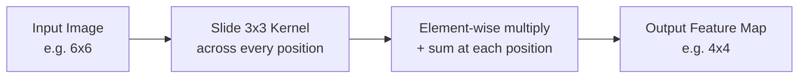

Intuition: each kernel is a small pattern detector. If the patch of the image "matches" the kernel's pattern, the dot product is large (strong activation); if not, it's small. Early kernels learn to detect edges/colors; the network learns the kernel values themselves via backpropagation — nobody hand-designs them.

---

## 2. Kernels/Filters, Strides, Padding, and Dilation

| Concept | What it is | Effect |
|---|---|---|
| **Kernel/Filter** | The small weight matrix (e.g. 3x3, 5x5) that slides over the image | Each filter learns to detect one specific pattern (edge, color blob, texture) |
| **Stride** | How many pixels the kernel jumps each step | Stride 1 = dense overlap, large output. Stride 2 = skips pixels, output shrinks by ~half — used to downsample instead of pooling |
| **Padding** | Adding extra pixels (usually zeros) around the image border | "Valid" (no padding) shrinks output each layer. "Same" padding keeps output size equal to input size, so borders aren't underrepresented |
| **Dilation** | Inserting gaps between kernel elements (a "spread out" kernel) | Enlarges the receptive field **without** adding parameters or losing resolution — used in segmentation networks (e.g. DeepLab) |

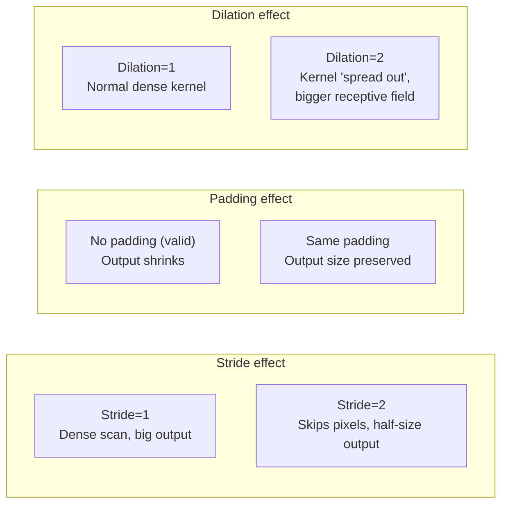

---

## 3. Receptive Field — Why It Grows With Depth

The **receptive field** of a neuron is the region of the *original input image* that influences its value. A single 3x3 conv neuron in layer 1 only "sees" a 3x3 patch. But a neuron in layer 2 sees the outputs of layer 1 neurons, each of which saw their own 3x3 patch — so the layer-2 neuron effectively "sees" a bigger patch of the original image.

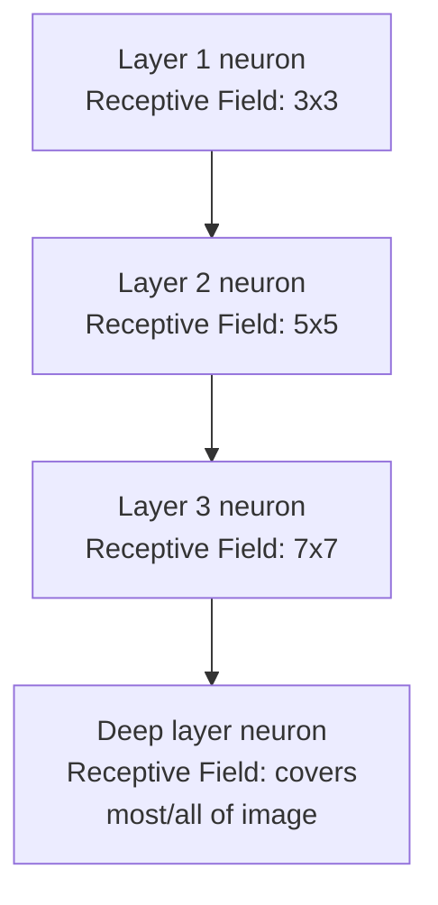

**Why this matters:** early layers can only detect tiny local patterns (edges), but by the time you reach deep layers, each "neuron" is integrating information from a large chunk (or all) of the image — which is required to recognize whole objects, not just fragments. Stacking layers, using strides, and pooling all **grow the receptive field faster** than just adding more same-sized layers alone.

---

## 4. Feature Maps, Channels, and Pooling

- **Feature map**: the 2D grid of outputs produced by sliding *one* kernel over the input — literally a "map" of where that pattern was detected.
- **Channels**: a conv layer usually has many kernels (e.g. 64), each producing its own feature map; stacked together they form a 3D volume with 64 **channels**. Deeper layers = more channels = network can track more distinct patterns simultaneously.
- **Pooling**: a downsampling operation that shrinks feature maps spatially while keeping the important information.

| Pooling Type | How it works | Use |
|---|---|---|
| **Max Pooling** | Takes the max value in each small window (e.g. 2x2) | Keeps the strongest activation, adds slight translation-invariance |
| **Average Pooling** | Takes the mean value in each window | Smoother downsampling, less sharp than max |
| **Global Pooling** (avg or max) | Collapses an entire feature map (H×W) into a single number | Used right before the final classifier to turn a spatial volume into a flat vector, replacing large dense layers |

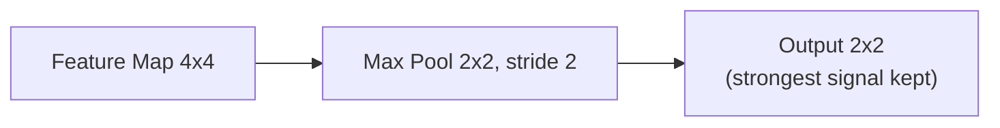

---

## 5. Activation Functions: ReLU, LeakyReLU, GELU, Swish

Activations introduce **non-linearity** — without them, stacking conv layers would collapse mathematically into one big linear operation, no matter how deep the network is.

| Activation | Formula (intuition) | Behavior | Effect on Training / Features |
|---|---|---|---|
| **ReLU** | max(0, x) | Zeroes out negatives, passes positives unchanged | Fast, simple, sparse activations; can suffer "dying ReLU" (neurons stuck outputting 0 forever) |
| **LeakyReLU** | x if x>0, else small×x (e.g. 0.01x) | Like ReLU but allows a small negative slope | Fixes dying ReLU by keeping a small gradient alive for negative inputs |
| **GELU** | Smooth, probabilistic gating of x | Smooth curve, no hard cutoff at 0 | Better gradient flow than ReLU; used in Transformers and modern CNNs; slightly more expensive to compute |
| **Swish / SiLU** | x × sigmoid(x) | Smooth, self-gated, non-monotonic | Used in EfficientNet/MobileNetV3; tends to outperform ReLU on deeper nets, small compute overhead |

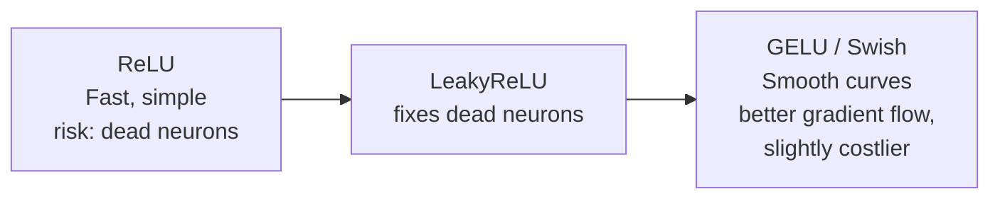

> [!tip] Practical takeaway
> ReLU/LeakyReLU = cheap and good defaults for most CNNs. GELU/Swish = smoother optimization landscape, often a small accuracy boost in modern/efficient architectures, at a small compute cost.

---

## 6. How Stacking Layers Increases Feature Hierarchy

Each additional conv layer doesn't just add "more of the same" — it lets the network **combine** the previous layer's simple detections into a more complex one.

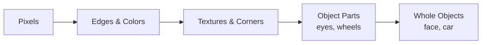

One layer alone can only represent simple patterns limited by its small receptive field. Stacking layers **compounds** complexity: layer *N* can represent combinations of everything layer *N-1* could represent, so hierarchy — and abstraction — grows with depth.

---

## 7. What Does Each Level of CNN Blocks Learn?

| Block Depth | Typical Learned Features |
|---|---|
| **Early blocks** | Edges, color gradients, simple textures — generic, task-independent |
| **Middle blocks** | Combinations of edges/textures → corners, simple shapes, repeating patterns |
| **Late blocks** | Object parts and whole-object templates — task-specific, tuned to the exact classes trained on |
| **Final layers (dense/softmax)** | Direct class decision — a weighted vote over the high-level features detected |

---

# PART 2 — Deep CNN Concepts (Architecture Tricks)

## 8. Residual (Skip) Connections and Identity Mapping

**Problem:** as networks get very deep (50+ layers), gradients shrink to near-zero by the time they backpropagate to early layers — the **vanishing gradient problem**. Very deep plain networks can actually perform *worse* than shallower ones.

**Solution (ResNet, 2015):** add a "skip connection" that carries the input **directly** to a later layer, added on top of what the conv layers computed:

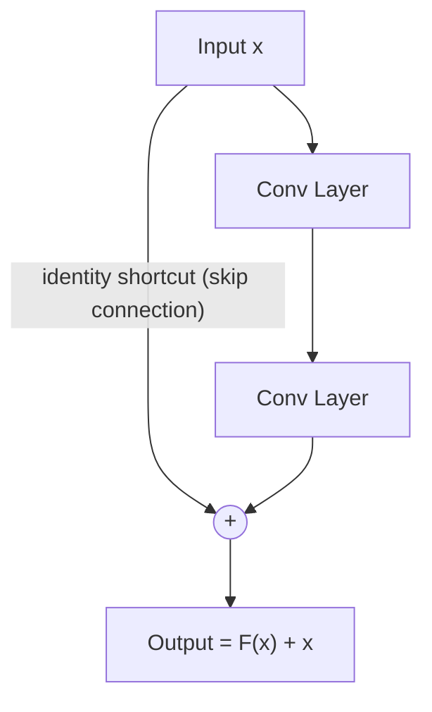

Instead of forcing each block to learn a full transformation, it only has to learn the **residual** F(x) = desired output − x. If the ideal function for a block is close to "do nothing" (identity), that's now trivial to represent — just push F(x) toward 0. This makes very deep networks (even 100+ layers) trainable, because gradients can flow directly through the identity shortcuts without vanishing.

---

## 9. Residual Blocks for Deeper Networks and Vanishing Gradients

A **residual block** wraps 2–3 conv layers with one skip connection, as shown above. Stacking dozens of these blocks lets ResNet architectures reach depths (34, 50, 101, 152 layers) that plain CNNs couldn't train reliably.

**Why it fixes vanishing gradients:** during backpropagation, the gradient can flow through the *shortcut path* essentially unchanged (derivative of identity = 1), bypassing the conv layers that might otherwise shrink it. This keeps early layers receiving a meaningful training signal even in very deep networks.

---

## 10. Bottleneck Blocks and 1×1 Convolutions

A **1×1 convolution** doesn't look at neighboring pixels at all — it only mixes information **across channels** at each spatial position. It's essentially a per-pixel fully-connected layer applied across the channel dimension.

**Bottleneck block** (used in ResNet-50/101/152): instead of two 3×3 convs, use three convs shaped like an hourglass:

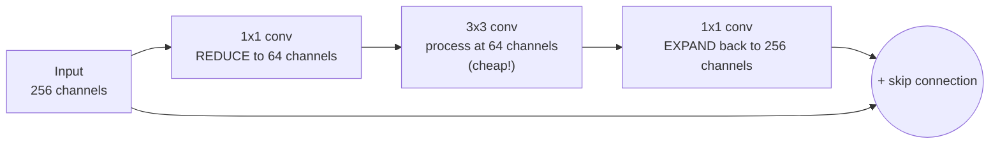

**Why it's efficient:** the expensive 3×3 convolution now operates on a much smaller number of channels (squeezed down by the first 1×1 conv), massively cutting the number of multiplications, then the last 1×1 conv restores the original channel depth so the block can still be stacked and skip-connected normally. This lets ResNet go deeper (50→152 layers) without an explosion in compute/parameters.

---

## 11. ResNet Variants: ResNet-50, 101, 152

| Variant | Block type | Depth | Notes |
|---|---|---|---|
| **ResNet-18 / 34** | Basic block (two 3×3 convs) | Shallower | Cheaper, used when compute is limited |
| **ResNet-50** | Bottleneck block (1x1 → 3x3 → 1x1) | 50 layers | Standard, very common transfer-learning backbone |
| **ResNet-101** | Bottleneck block | 101 layers | More capacity, more compute, marginal accuracy gains over 50 |
| **ResNet-152** | Bottleneck block | 152 layers | Deepest common variant, diminishing accuracy returns per extra layer |

All of them share the same core idea — repeated residual blocks — the difference is purely **how many blocks/stages are stacked**, and whether basic or bottleneck blocks are used.

---

## 12. Depthwise Separable Convolutions & Pointwise Convolutions

A **standard convolution** mixes spatial information AND channel information in one single operation — this is powerful but expensive.

A **depthwise separable convolution** splits this into two cheaper steps:

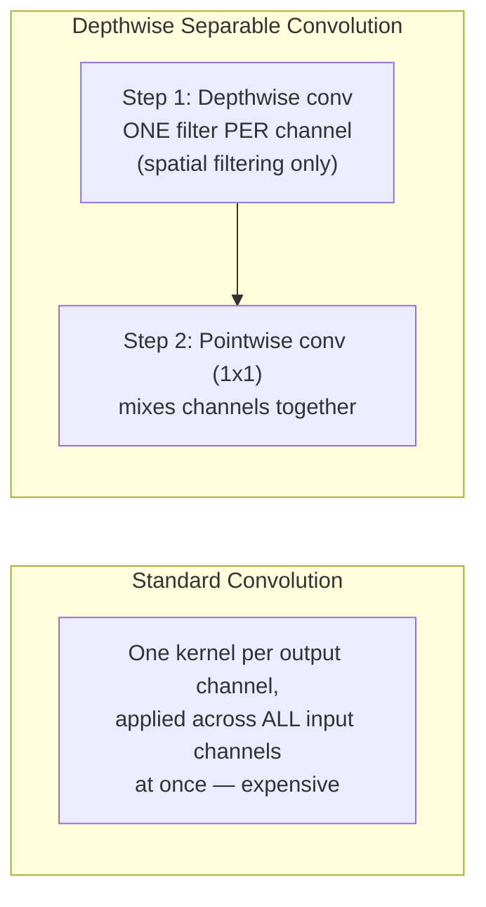

1. **Depthwise convolution**: applies a single small filter to *each input channel separately* (no cross-channel mixing) — handles the spatial filtering.
2. **Pointwise convolution** (1×1 conv): then mixes information *across* channels — handles the channel combination.

---

## 13. Why Is Depthwise Separable Convolution Computationally Efficient?

A standard convolution with kernel size k, `Cin` input channels, `Cout` output channels, over an H×W feature map costs roughly:

`Cost_standard ≈ H × W × Cin × Cout × k × k`

A depthwise separable convolution costs:

`Cost_depthwise ≈ H × W × Cin × k × k` (depthwise step)
`Cost_pointwise ≈ H × W × Cin × Cout` (pointwise step)

Combined, this is roughly **8–9x cheaper** than a standard convolution for typical kernel sizes (e.g. k=3), because you've factored one big expensive operation into two much smaller ones (spatial filtering and channel mixing are no longer done simultaneously by the same expensive operation). This is *the* core trick that makes MobileNet-family networks fast enough to run on phones.

---

## 14. Inverted Residual Block with Linear Bottleneck (MobileNetV2)

Normal ResNet bottlenecks go **wide → narrow → wide** (squeeze channels down for the expensive op, then expand back). MobileNetV2 **inverts** this:

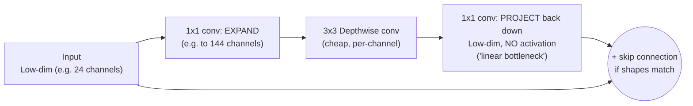

- **Expansion**: first widen the channels (opposite of ResNet's squeeze) so the depthwise convolution has more room to extract rich features cheaply.
- **Depthwise conv**: does the actual spatial filtering cheaply, since it's per-channel.
- **Linear bottleneck**: the final projection layer back down to a small channel count has **no non-linearity** (no ReLU) — because applying ReLU to a low-dimensional space tends to destroy useful information (a "linear bottleneck" preserves it).
- **Residual/skip connection** connects the low-dimensional input and output (only when shapes match), same purpose as ResNet — helps gradient flow.

This is called "inverted" because the skip connections link the **narrow (bottleneck)** representations, while the wide expansion happens *inside* the block instead of outside it, opposite of a classic ResNet bottleneck.

---

## 15. How MobileNetV2 Uses Expansion Factors, Pointwise Convs, and Residuals — Put Together

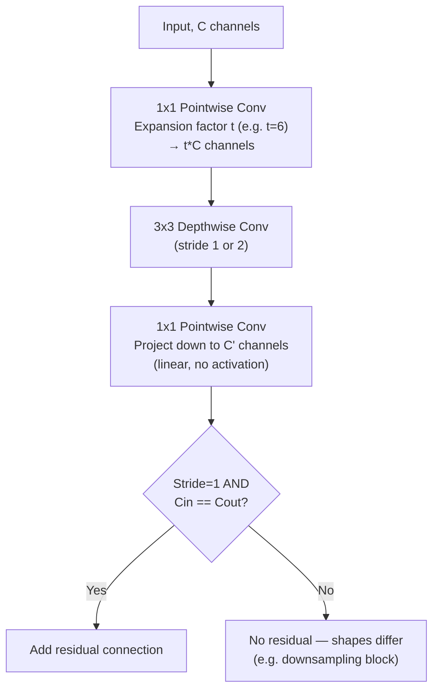

- **Expansion factor `t`**: a hyperparameter (commonly 6) controlling how much wider the intermediate depthwise layer is compared to the block's input/output — trades a bit of compute for more expressive power per block.
- **Pointwise convs** do all the channel-count changes (expand and project) cheaply since they're 1×1.
- **Residual connections** are only added when input and output shapes match (same channels, stride 1); when the block also downsamples (stride 2) or changes channel count, there's no shortcut for that block.

Together this gives MobileNetV2 ResNet-like trainability and accuracy while keeping the expensive part (depthwise conv) working on a manageable number of channels — ideal for mobile/edge devices.

---

## 16. EfficientNet's Compound Scaling Strategy

Traditionally, to make a CNN more powerful people scale **one dimension at a time**:
- **Depth** (more layers)
- **Width** (more channels per layer)
- **Resolution** (bigger input images)

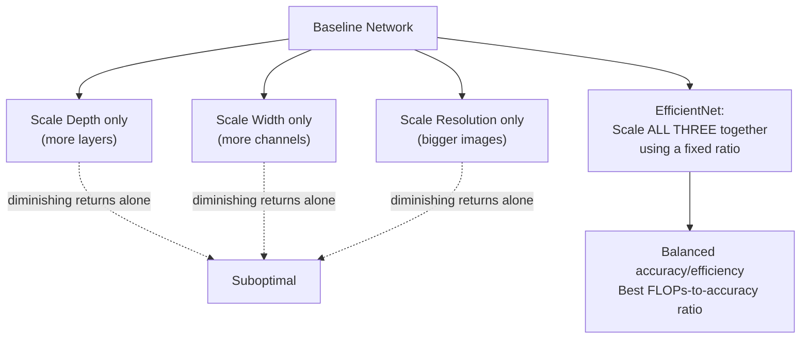

**EfficientNet's insight:** scaling only one dimension quickly hits diminishing returns (e.g. a super deep but narrow, low-res network wastes capacity). Instead, EfficientNet scales **depth, width, and resolution together**, using a small set of coefficients derived from a compound scaling formula, so all three grow in a balanced ratio. This produces a family of models (B0 → B7) that each hit a better accuracy-per-FLOP tradeoff than scaling any single dimension alone.

---

## 17. How FLOPs and Parameter Count Influence Architecture Choice

| Metric | What it measures | Why it matters |
|---|---|---|
| **FLOPs** (floating point operations) | Total compute needed for one forward pass | Determines inference **speed/latency** — critical for real-time or mobile/edge apps |
| **Parameter count** | Total number of learnable weights | Determines **memory footprint** (model file size, RAM/VRAM needed) and affects overfitting risk on small datasets |

**How they shape architecture choice:**
- **Mobile/edge deployment (low FLOPs & params budget)** → MobileNet, EfficientNet-lite, depthwise separable convs everywhere.
- **Cloud/server, accuracy-first (large FLOPs & params budget OK)** → ResNet-152, EfficientNet-B7, larger ViT/ConvNeXt backbones.
- **Small training dataset** → prefer fewer parameters (less overfitting risk) even if compute budget would allow more.
- **Latency-sensitive real-time systems (video, robotics)** → FLOPs matter more than raw parameter count, since FLOPs map more directly to inference time.

> [!tip] Rule of thumb
> More parameters ≠ always better. The real design question is always: *what's the best accuracy I can get within my compute, memory, and latency budget?* This is exactly the problem depthwise separable convolutions, bottlenecks, and compound scaling were all invented to solve.

---

## Quick Reference — One-Sentence Summary Per Objective

- **2D convolution**: slides a small kernel over the image, computing dot products to produce a feature map.
- **Kernel/stride/padding/dilation**: filter size, step size, border handling, and gap-spacing between kernel elements — all control output size and receptive field.
- **Receptive field**: the input region a neuron "sees"; grows with depth, letting deep layers understand whole objects.
- **Feature maps/channels/pooling**: each filter produces a feature map; many stacked = channels; pooling downsamples while keeping key info.
- **Activations (ReLU/LeakyReLU/GELU/Swish)**: add non-linearity; smoother ones (GELU/Swish) often train better in deep/modern nets.
- **Stacking layers**: builds a feature hierarchy — simple patterns combine into complex, abstract ones.
- **What each block level learns**: edges → textures → parts → whole objects, general to task-specific.
- **Residual/skip connections**: let gradients flow directly through identity shortcuts, fixing vanishing gradients in deep nets.
- **Bottleneck blocks/1x1 convs**: squeeze channels down before the expensive 3x3 conv, then expand back — cheaper deep networks.
- **ResNet variants**: 50/101/152 differ mainly in how many bottleneck blocks are stacked.
- **Depthwise separable convolution**: splits spatial filtering (depthwise) and channel mixing (pointwise) into two cheaper steps.
- **Why it's efficient**: replaces one expensive combined operation with two much cheaper ones — ~8-9x fewer computations.
- **Inverted residual + linear bottleneck (MobileNetV2)**: expand → depthwise filter → project down without activation, with residuals linking the narrow ends.
- **MobileNetV2 expansion factor**: controls how much wider the depthwise stage is relative to the block's input/output channels.
- **EfficientNet compound scaling**: scales depth, width, and resolution together in a fixed ratio instead of one at a time.
- **FLOPs & parameter count**: compute and memory budgets that directly shape which architecture fits a given deployment target.
