# Keras & TensorFlow: Building, Training & Evaluating Neural Networks

> [!abstract] Big Picture
> **TensorFlow** is the low-level engine that does the actual math (tensors, gradients, GPU execution). **Keras** is the high-level API sitting on top of it that lets you build, train, and evaluate neural networks with a handful of readable lines of code instead of writing raw gradient computations yourself.

---

## 1. What is TensorFlow?

TensorFlow is an open-source library for numerical computation and machine learning, built around **tensors** (multi-dimensional arrays) and **automatic differentiation** (automatically computing gradients for backpropagation).

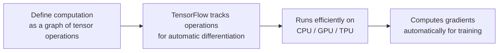

It handles the heavy lifting: efficient tensor math, GPU/TPU acceleration, automatic gradient computation, and distributed training — the foundation that any deep learning model actually runs on.

---

## 2. What is Keras?

Keras is a **high-level deep learning API** (now the official high-level API of TensorFlow, and also runnable on JAX or PyTorch backends via Keras 3) that provides simple, readable building blocks — layers, models, losses, optimizers, callbacks — so you can build and train neural networks without writing low-level tensor operations by hand.

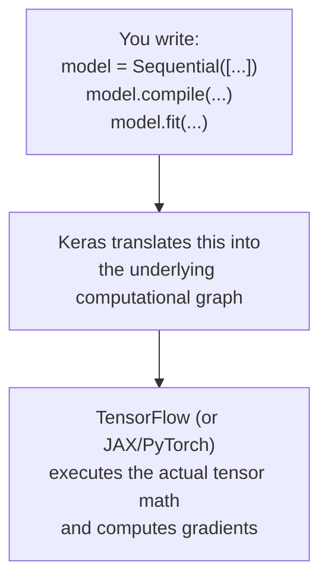

**Analogy:** if TensorFlow is the engine and transmission of a car, Keras is the steering wheel and pedals — a simple, human-friendly interface for controlling something complex underneath.

---

## 3. What is a Model?

A **model** is the collection of layers, weights, and the computation graph connecting them that together take an input and produce a prediction. It also bundles the information needed to train it: a loss function, an optimizer, and (optionally) metrics to track.

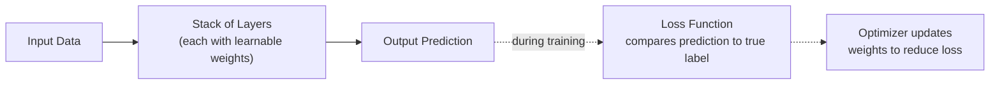

In Keras specifically, a "model" is a Python object (`keras.Model`, or its subclass `Sequential`) that wraps this whole structure and exposes convenient methods: `.compile()`, `.fit()`, `.evaluate()`, `.predict()`, `.save()`.

---

## 4. What is a Shallow Neural Network?

A shallow neural network has **very few layers** — typically just one hidden layer between the input and output (sometimes called a "single-layer perceptron" when there's no hidden layer at all, just input directly to output).

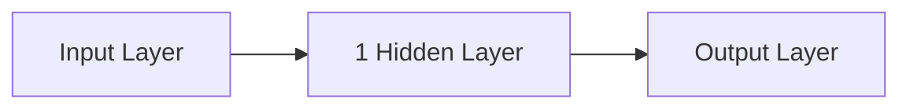

Shallow networks can only learn relatively simple, low-complexity mappings between inputs and outputs — they lack the capacity to build up the deep feature hierarchies that make modern deep learning powerful, though they're still useful for simple problems and are cheap/fast to train.

---

## 5. What Defines a Deep Neural Network?

A network is considered "deep" when it has **multiple hidden layers stacked on top of each other** (there's no strict universal cutoff, but generally 2+ hidden layers, often many more in modern architectures).

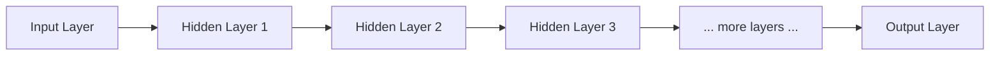

**What "depth" buys you:** each additional layer lets the network compose the representations learned by the previous layer into something more abstract — this is exactly the feature hierarchy you'd see in a CNN (edges → textures → parts → objects), but the general principle applies to any deep network. Depth is what allows networks to learn highly complex, non-linear functions that shallow networks simply don't have the capacity to represent efficiently.

---

## 6. What is the Sequential Model in Keras?

The **Sequential model** is the simplest way to build a Keras model: a **linear stack of layers**, where data flows straight through from the first layer to the last, one after another, with no branching or merging.

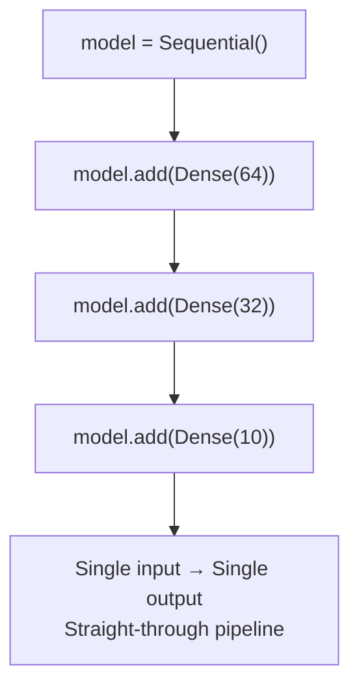

```python
model = keras.Sequential([
    keras.layers.Dense(64, activation="relu"),
    keras.layers.Dense(32, activation="relu"),
    keras.layers.Dense(10, activation="softmax"),
])
```

Simple, readable, and covers the majority of basic use cases — but it **cannot** handle multiple inputs/outputs, shared layers, or non-linear topologies (like skip connections).

---

## 7. What is the Functional API in Keras?

The **Functional API** builds models by treating layers as **callable functions** on tensors, explicitly wiring together inputs and outputs — allowing arbitrary graph topologies, not just a straight line.

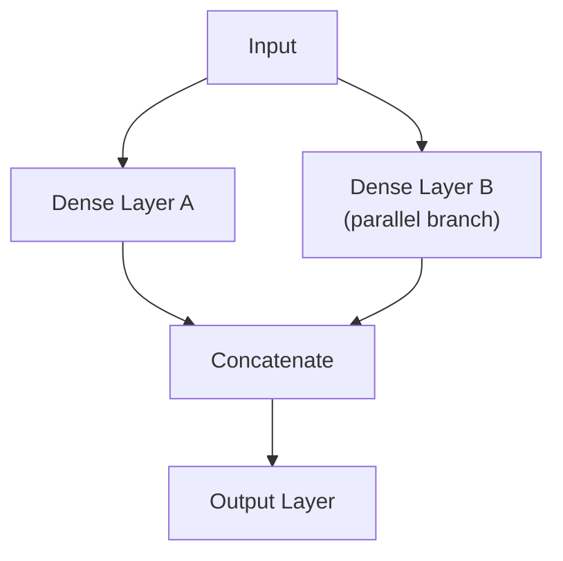

```python
inputs = keras.Input(shape=(784,))
x1 = keras.layers.Dense(64, activation="relu")(inputs)
x2 = keras.layers.Dense(64, activation="relu")(inputs)
merged = keras.layers.Concatenate()([x1, x2])
outputs = keras.layers.Dense(10, activation="softmax")(merged)
model = keras.Model(inputs=inputs, outputs=outputs)
```

This makes it possible to build: multiple inputs/outputs, branching and merging paths, skip/residual connections, shared layers (the same layer object reused on different inputs) — essentially anything with a non-linear graph structure.

---

## 8. When Should You Use Sequential vs. Functional?

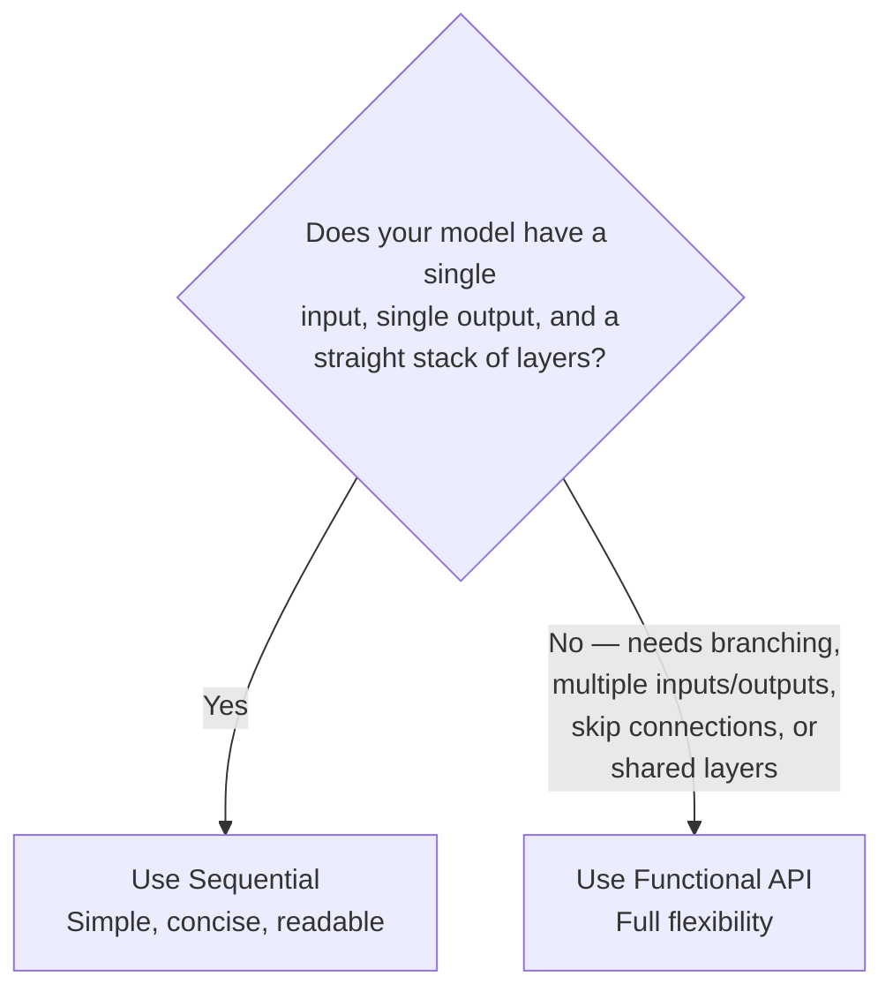

| | **Sequential** | **Functional API** |
|---|---|---|
| Topology | Linear stack only | Any directed acyclic graph |
| Multiple inputs/outputs | Not supported | Fully supported |
| Skip/residual connections | Not supported | Fully supported |
| Shared layers | Not supported | Fully supported |
| Readability for simple models | Very concise | Slightly more verbose |

**Rule of thumb:** start with Sequential for straightforward feedforward architectures; reach for the Functional API the moment you need anything more complex than "layer after layer after layer" — like a ResNet-style skip connection or a model with two separate input streams (e.g. image + tabular data).

---

## 9. What Does Compiling a Model in Keras Do?

`model.compile()` configures the model **for training** by specifying three key things: the **optimizer** (how weights get updated), the **loss function** (what's being minimized), and the **metrics** (what to monitor, e.g. accuracy).

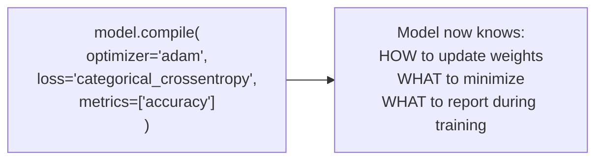

Compiling doesn't train the model yet — it just wires up the pieces the training loop will use. It also builds the internal computation graph needed for efficient execution.

---

## 10. How Do You Train a Model in Keras?

Training happens via `model.fit()`, which runs the forward pass → loss computation → backpropagation → weight update loop repeatedly over your data.

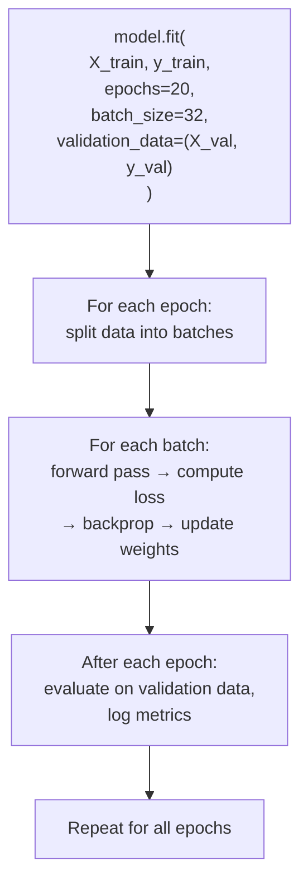

Key parameters: `epochs` (how many full passes over the training data), `batch_size` (how many samples per gradient update), `validation_data` or `validation_split` (held-out data to monitor generalization during training), and `callbacks` (extra logic to run during training, e.g. early stopping, checkpointing, TensorBoard logging).

---

## 11. How Do You Choose the Right Loss Function and Optimizer?

**Loss function** — must match your task type:

| Task | Typical Loss |
|---|---|
| Binary classification | `binary_crossentropy` |
| Multi-class classification (one-hot labels) | `categorical_crossentropy` |
| Multi-class classification (integer labels) | `sparse_categorical_crossentropy` |
| Regression | `mean_squared_error` or `mean_absolute_error` |

**Optimizer** — controls how weights are updated:

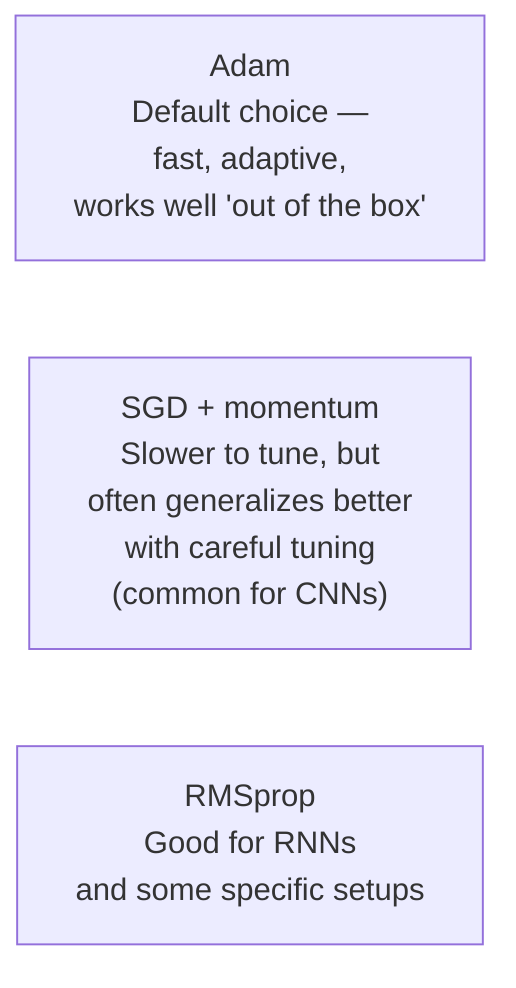

**Rule of thumb:** default to `Adam` for a strong, low-effort baseline on almost any problem. Match the loss strictly to the output type (don't use MSE for classification, or crossentropy for regression) — this is the single most common beginner mistake.

---

## 12. How Can You Monitor Performance During Training?

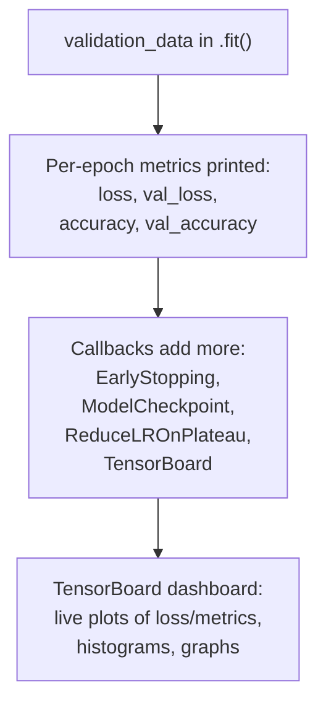

- **Validation metrics** printed every epoch (via `validation_data`) are the primary real-time signal of whether the model is actually generalizing, not just memorizing.
- **Callbacks** (`keras.callbacks`) hook into the training loop: `EarlyStopping` (stop when validation loss plateaus), `ModelCheckpoint` (save the best model seen so far), `ReduceLROnPlateau` (shrink the learning rate when progress stalls), and `TensorBoard` (log everything for visual inspection).
- The **History object** returned by `.fit()` stores per-epoch loss/metric values, which you can plot yourself (e.g. with matplotlib) to visually inspect training vs validation curves.

---

## 13. How Do You Assess the Performance of a Trained Model?

`model.evaluate()` runs the trained model over a dataset (typically the held-out **test set**) and reports the loss and any metrics specified at compile time — a single, final, honest measurement of how well the model performs on data it never saw during training or tuning.

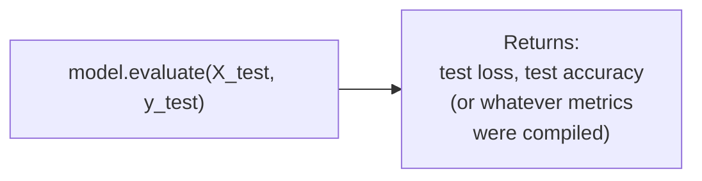

For a deeper picture beyond a single accuracy number, combine this with `model.predict()` outputs fed into tools like `classification_report` or a confusion matrix (precision, recall, F1 per class) — exactly as you would for any other classifier.

---

## 14. How Do You Make Predictions on New Data?

`model.predict()` runs new, unlabeled data through the trained network's forward pass and returns the raw outputs (e.g. class probabilities for classification, or continuous values for regression) — no training/gradient computation happens.

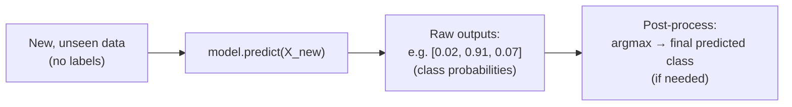

For classification, you typically follow `.predict()` with `argmax` (pick the highest-probability class) to get the final predicted label, since `.predict()` itself just returns the raw probability/score vector.

---

## 15. How Do You Save an Entire Keras Model?

`model.save("my_model.keras")` saves **everything**: the architecture (layer structure), the trained weights, the optimizer state, and the training configuration (loss, metrics) — enough to reload the model and immediately continue training or run inference, with zero extra code needed to rebuild the architecture.

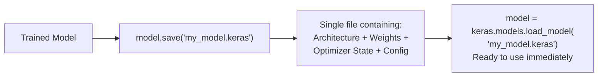

---

## 16. How Do You Save Only the Weights of a Model?

`model.save_weights("my_weights.weights.h5")` saves **only the numeric parameter values** (weights and biases), not the architecture or optimizer state. To use them again, you must first rebuild the exact same model architecture in code, then call `model.load_weights(...)`.

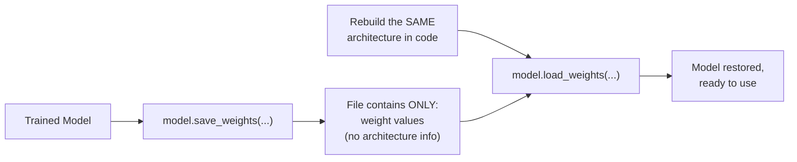

**When to use this instead of a full save:** transfer learning (loading pretrained weights into a slightly different model, e.g. swapping the final classifier head), smaller file sizes when you don't need optimizer state, or when you specifically want to version-control the architecture code separately from the trained parameters.

---

## 17. What is TensorBoard and What is it Used For?

TensorBoard is TensorFlow's **visualization dashboard** for monitoring and debugging training runs — it reads log files written during training (via the `TensorBoard` callback) and renders them as interactive plots in a browser.

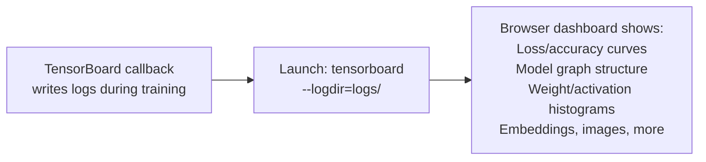

**What it's used for:**
- Watching **training vs validation loss/accuracy curves live**, in real time, instead of just reading printed numbers.
- Visualizing the **model's computation graph** to sanity-check architecture.
- Inspecting **histograms of weights and activations** over time — useful for spotting vanishing/exploding gradients or dead neurons.
- Comparing **multiple training runs** side by side (different hyperparameters, different architectures) to decide what worked best.
- Visualizing high-dimensional embeddings (e.g. projecting learned feature vectors down to 2D/3D for inspection).

---

## Quick Reference — One-Sentence Summary Per Objective

- **Keras**: a high-level, user-friendly API for building and training neural networks.
- **TensorFlow**: the low-level engine handling tensor math, automatic differentiation, and hardware acceleration underneath Keras.
- **Model**: the combination of layers, weights, loss, and optimizer that maps inputs to predictions and can be trained.
- **Shallow neural network**: a network with just one (or zero) hidden layers, limited representational capacity.
- **Deep neural network**: a network with multiple stacked hidden layers, enabling a hierarchy of increasingly abstract features.
- **Sequential model**: a simple, linear stack of layers with one input and one output.
- **Functional API**: builds models as an explicit graph of layer calls, supporting branching, merging, multiple inputs/outputs, and shared layers.
- **Sequential vs Functional**: use Sequential for simple straight-through architectures, Functional API for anything with non-linear topology.
- **Compiling a model**: configures the optimizer, loss function, and metrics before training begins.
- **Training a model**: `model.fit()` repeatedly runs forward pass → loss → backprop → weight update across batches and epochs.
- **Choosing loss/optimizer**: match the loss function strictly to the task type (classification vs regression); default to Adam as a strong general-purpose optimizer.
- **Monitoring performance**: use validation data, the History object, and callbacks (EarlyStopping, TensorBoard, etc.) to track training in real time.
- **Assessing a trained model**: `model.evaluate()` on the untouched test set gives a final, honest performance measurement.
- **Making predictions**: `model.predict()` runs new data through the trained network to get raw outputs (probabilities/values).
- **Saving an entire model**: `model.save()` stores architecture, weights, and optimizer state together in one file.
- **Saving only weights**: `model.save_weights()` stores just the parameter values, requiring the same architecture to be rebuilt before loading.
- **TensorBoard**: a visualization dashboard for tracking training curves, model graphs, and weight/activation histograms during and after training.
