# Optimization, Regularization & Hyperparameter Tuning

> [!abstract] Big Picture
> Training a neural network = solving an **optimization problem**: find the weights that minimize a loss function. But minimizing loss perfectly on training data isn't the real goal — the real goal is **generalization** (doing well on unseen data). This note covers the algorithms that do the minimizing (optimizers), the tricks that prevent the model from over-memorizing (regularization), and the process of choosing all the knobs in between (hyperparameter tuning).

---

# PART 1 — Optimization

## 1. What is Optimization?

Optimization is the process of adjusting a model's weights to **minimize a loss function** — a number that measures how wrong the model's predictions are. Training a neural network is fundamentally a search: over a huge, high-dimensional landscape of possible weight values, find a point (or region) where the loss is low.

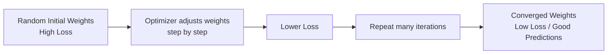

Think of the loss function as a landscape of hills and valleys (in millions of dimensions). Optimization = walking downhill toward a valley (low loss), using the **gradient** (slope) to know which direction is "down."

---

## 2. How Does SGD Work?

**Stochastic Gradient Descent (SGD)**: instead of computing the gradient using the *entire* dataset every step (expensive), SGD estimates the gradient using a small random **batch** of examples (or even a single example), then updates weights immediately.

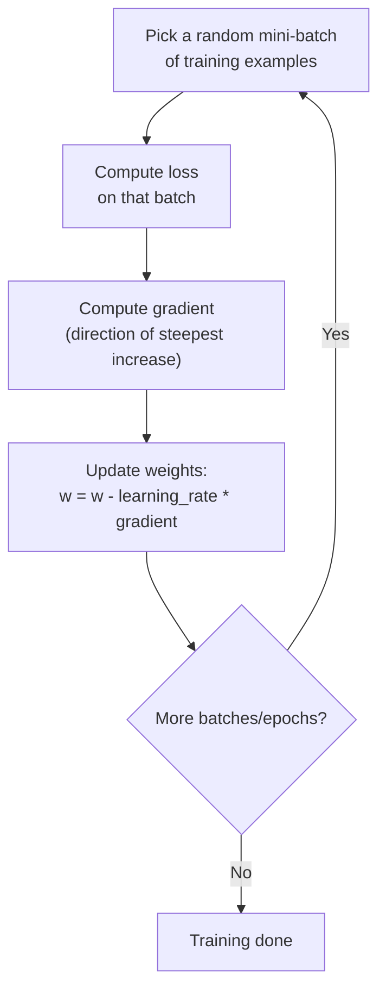

Formula: `w_new = w_old − learning_rate × ∇Loss(w_old)`

Because each step only "sees" a small batch, the path SGD takes toward the minimum is **noisy/zig-zaggy** rather than perfectly smooth — but this noise is actually a feature, not a bug: it helps escape shallow local minima and saddle points, and it's far cheaper computationally than using the full dataset every step.

---

## 3. What is Momentum in SGD?

Plain SGD can oscillate badly in narrow, steep valleys (zig-zagging back and forth instead of moving efficiently toward the minimum). **Momentum** fixes this by accumulating a running average of past gradients, so the optimizer keeps moving in a consistent direction, like a ball rolling downhill and picking up speed.

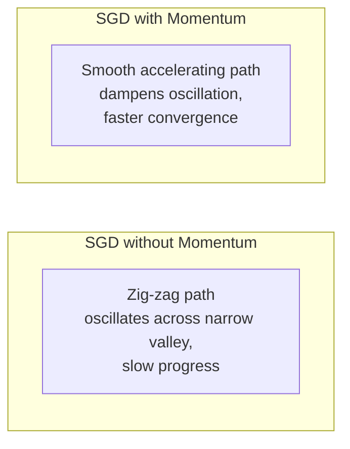

Formula: `v = β × v_prev + (1−β) × gradient` then `w = w − learning_rate × v`

`β` (commonly 0.9) controls how much "memory" of past gradients is kept. High momentum = smoother path but risk of overshooting the minimum; low momentum ≈ plain SGD.

---

## 4. What Are Adaptive Optimizers?

Instead of using the same learning rate for every single weight in the network, **adaptive optimizers** give each parameter its **own effective learning rate**, based on the history of gradients for that specific parameter.

| Optimizer | Key Idea |
|---|---|
| **AdaGrad** | Divides the learning rate by the accumulated sum of past squared gradients per parameter — parameters that get frequent large gradients slow down over time; rarely-updated parameters keep larger steps |
| **RMSProp** | Like AdaGrad but uses a *moving average* (not a full sum) of squared gradients, so the learning rate doesn't shrink to zero over long training runs |
| **Adam** | Combines momentum (moving average of gradients) **and** RMSProp-style adaptive per-parameter scaling (moving average of squared gradients) — the most widely used default optimizer in deep learning |

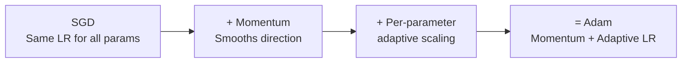

---

## 5. When Should You Use Adam vs. SGD?

| | **Adam** | **SGD (+ momentum)** |
|---|---|---|
| Convergence speed | Fast, forgiving of learning rate choice | Slower, more sensitive to learning rate |
| Final generalization | Sometimes slightly worse (can converge to sharper minima) | Often generalizes better with proper tuning, especially on image classification (CNNs) |
| Ease of use | Great default, works "out of the box" for most problems | Needs more careful learning-rate/schedule tuning |
| Common usage | NLP, Transformers, quick prototyping, transfer learning fine-tuning | Large-scale CNN training (ResNet, ImageNet-style training), when squeezing out best possible accuracy |

**Rule of thumb:** start with Adam for fast, reliable convergence and prototyping. If you have time/compute to tune carefully and are chasing state-of-the-art accuracy (especially in vision), SGD with momentum + a good learning rate schedule often wins.

---

## 6. What is a Learning Rate Schedule?

The **learning rate** controls how big each optimization step is. Too high → overshoots and diverges. Too low → painfully slow, may get stuck. A **learning rate schedule** changes the learning rate *during* training instead of keeping it fixed.

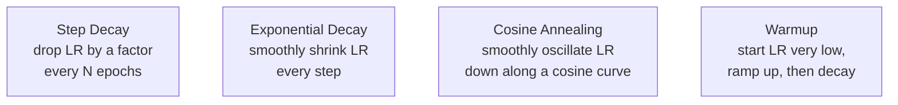

**Why it helps:** a larger learning rate early in training lets the model make fast progress across the broad landscape; a smaller learning rate later lets it settle precisely into a good minimum without overshooting it. Warmup specifically helps stabilize very early training when gradients can be unreliable (common with Adam and Transformers).

---

## 7. Why Initialize Weights (Carefully)?

If all weights start at the same value (e.g. all zeros), every neuron in a layer computes the **exact same output and gradient** — they never differentiate from each other, no matter how long you train ("symmetry problem"). If weights are initialized too large or too small, activations/gradients can **explode or vanish** as they pass through many layers.

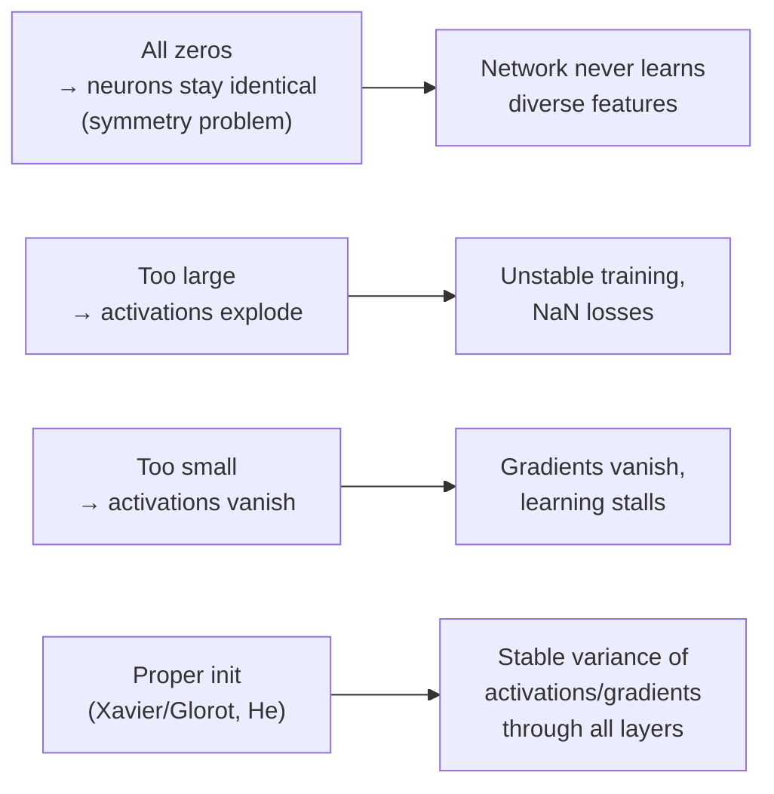

Good initialization schemes (**Xavier/Glorot** for tanh/sigmoid, **He initialization** for ReLU-family) scale the random initial weights based on the number of input/output connections, keeping the variance of activations roughly constant layer to layer — giving training a stable starting point.

---

# PART 2 — Regularization & Overfitting

## 8. What is Overfitting?

Overfitting is when a model learns the training data **too well** — including its noise and quirks — instead of learning generalizable patterns. Symptom: training loss keeps dropping, but validation/test loss stops improving or gets worse.

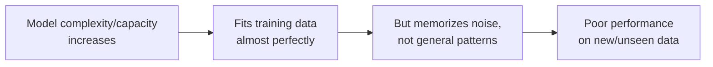

---

## 9. What is L2 Regularization?

L2 regularization (a.k.a. **weight decay**) adds a penalty term to the loss function proportional to the **sum of squared weights**:

`Loss_total = Loss_original + λ × Σ(w²)`

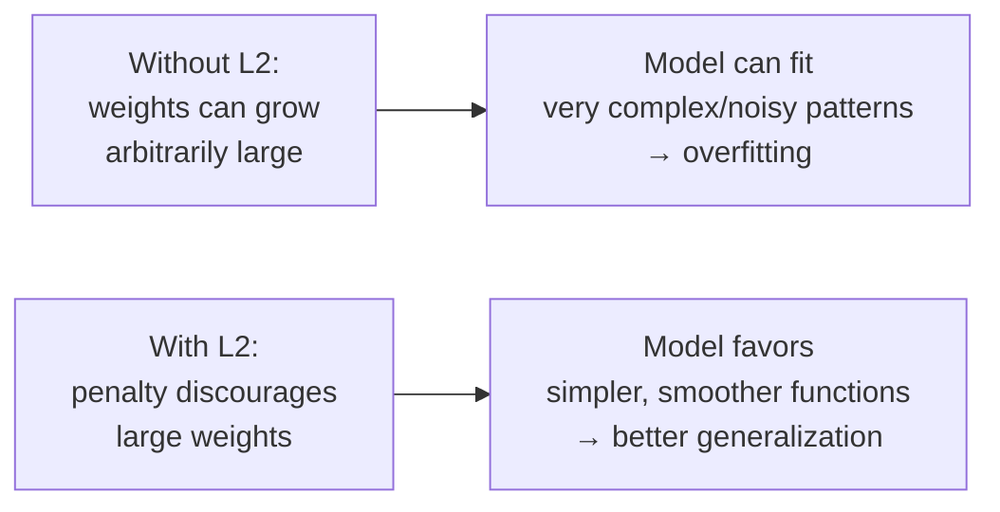

`λ` (lambda) controls the strength of the penalty. This discourages any single weight from becoming extremely large and dominating the prediction, pushing the model toward smoother, simpler decision boundaries that generalize better.

---

## 10. What is Dropout?

Dropout randomly **"turns off" (zeroes out)** a fraction of neurons during each training step (e.g. 50%), forcing the network to not rely too heavily on any single neuron or specific combination of neurons.

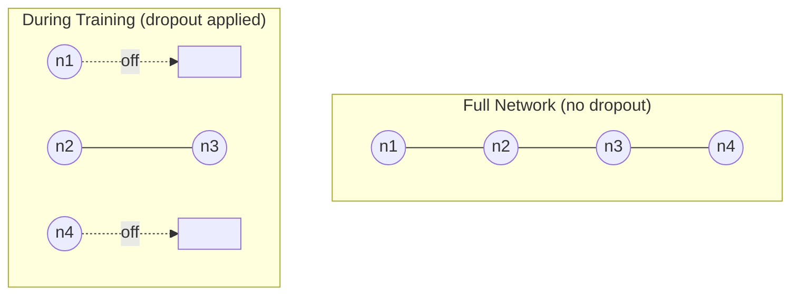

At test time, dropout is turned off and all neurons are used (typically with outputs scaled to account for the fact that fewer neurons were active during training). The effect is similar to training a large ensemble of different "thinned" sub-networks and averaging them — this redundancy makes the model more robust and less dependent on any single feature detector.

---

## 11. What is Early Stopping?

Early stopping monitors **validation loss** during training and stops training as soon as validation loss stops improving (even though training loss might still be decreasing) — preventing the model from over-training into the overfitting zone.

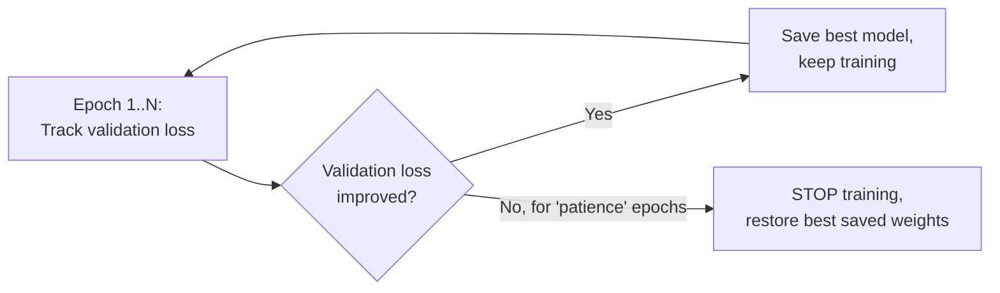

`Patience` = how many epochs to wait for improvement before giving up. This is essentially a free, simple regularizer — it costs nothing extra to implement and directly optimizes for what you actually care about (generalization), rather than training loss.

---

## 12. Training Loss vs. Validation Loss — What's the Difference?

| | **Training Loss** | **Validation Loss** |
|---|---|---|
| Computed on | Data the model is actively learning from | Held-out data the model never trains on |
| What it measures | How well the model fits data it has seen | How well the model generalizes to unseen data |
| Expected trend | Should steadily decrease as training progresses | Should decrease initially, then plateau or rise if overfitting starts |
| Use | Sanity check that the model is learning at all | The real signal for model quality, early stopping, and hyperparameter decisions |

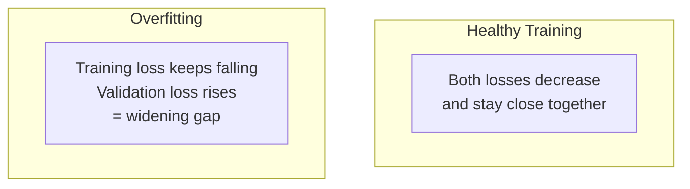

**The gap between the two curves is literally a visual measurement of overfitting** — a small, stable gap is healthy; a growing gap means the model is starting to memorize the training set.

---

# PART 3 — Hyperparameter Tuning

## 13. What is Hyperparameter Tuning?

**Hyperparameters** are settings chosen *before* training that aren't learned by gradient descent (e.g. learning rate, batch size, number of layers, dropout rate, L2 strength). Hyperparameter tuning is the systematic search for the combination of these settings that gives the best validation performance.

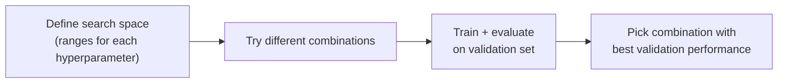

---

## 14. How to Build a Tunable Model?

A "tunable" model is built by **parameterizing** the architecture and training config, instead of hard-coding values, so a tuning framework can programmatically try different options:

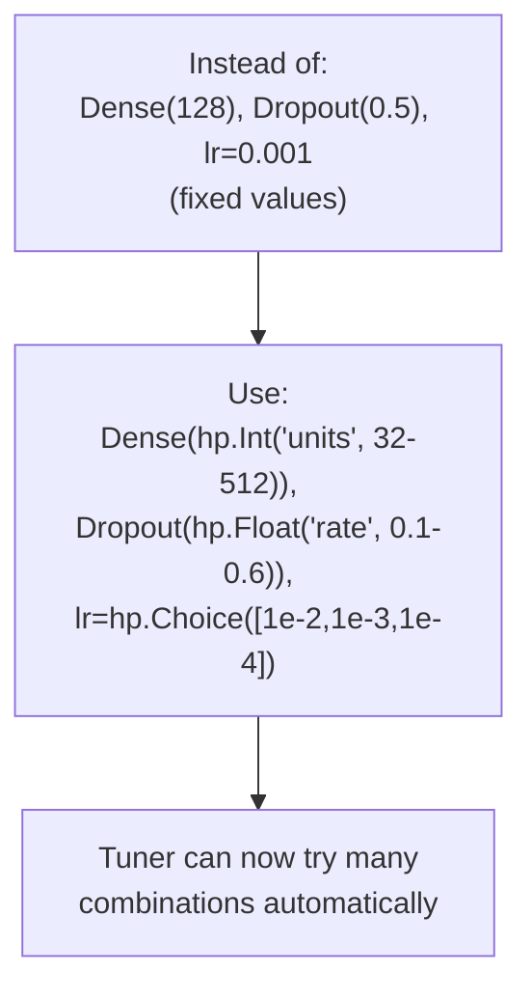

In practice (e.g. with Keras Tuner), you write a `build_model(hp)` function where every design choice you want to search over (units per layer, number of layers, activation, dropout rate, learning rate, optimizer type) is expressed via `hp.Int(...)`, `hp.Float(...)`, or `hp.Choice(...)` calls instead of fixed numbers.

---

## 15. What Are Tuner Types?

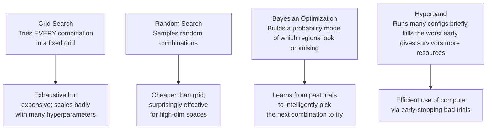

| Tuner | Strategy | Pros | Cons |
|---|---|---|---|
| **Grid Search** | Try every combination in a predefined grid | Simple, exhaustive within the grid | Explodes combinatorially with more hyperparameters |
| **Random Search** | Sample random combinations from ranges | Cheap, often finds good results fast | No guarantee it finds the optimum; some luck involved |
| **Bayesian Optimization** | Model which regions of the search space are promising based on past results | Smarter, fewer trials needed for good results | More complex, slightly more overhead per trial |
| **Hyperband** | Allocate resources adaptively; cut underperforming trials early | Very compute-efficient | Assumes early performance is predictive of final performance |

---

## 16. How to Choose the Best Hyperparameters?

1. **Define the search space** sensibly — realistic, not too wide (wastes compute) or too narrow (misses good options).
2. **Pick an appropriate tuner** given your compute budget: Random Search or Hyperband for a fast, cheap first pass; Bayesian Optimization when you can afford a more careful, guided search.
3. **Always evaluate on a validation set** (never the test set) — the test set must stay untouched until the very end to give an honest final performance estimate.
4. **Use early stopping inside each trial** so that bad configurations don't waste your compute budget training to completion.
5. **Compare and select** the configuration with the best validation metric (not the best training metric — that only measures memorization).
6. **Re-train the final chosen configuration** (optionally on train+validation combined) and evaluate once on the untouched **test set** to report final performance.

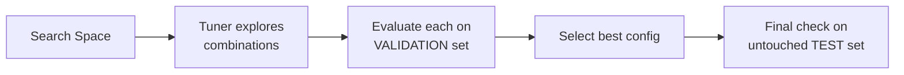

---

## Quick Reference — One-Sentence Summary Per Objective

- **Optimization**: the process of adjusting weights to minimize a loss function.
- **SGD**: updates weights using gradients estimated from small random batches instead of the whole dataset.
- **Momentum**: accumulates past gradients to smooth and accelerate optimization, reducing zig-zagging.
- **Adaptive optimizers**: give each parameter its own learning rate based on gradient history (AdaGrad, RMSProp, Adam).
- **Adam vs SGD**: Adam converges fast and is forgiving to tune; SGD+momentum often generalizes better with careful tuning, especially for CNNs.
- **Learning rate schedule**: changes the learning rate over training (decay, cosine, warmup) instead of keeping it fixed.
- **Weight initialization**: prevents symmetry problems and exploding/vanishing activations by starting with a well-scaled random distribution.
- **Overfitting**: the model memorizes training data instead of generalizing, showing as a training/validation loss gap.
- **L2 regularization**: penalizes large weights to encourage simpler, smoother models.
- **Dropout**: randomly disables neurons during training to prevent over-reliance on specific units.
- **Early stopping**: halts training once validation loss stops improving, preventing over-training.
- **Training vs validation loss**: training loss measures fit to seen data; validation loss measures generalization to unseen data.
- **Hyperparameter tuning**: systematically searching for the best non-learned settings (learning rate, layers, dropout, etc.).
- **Tunable model**: a model whose architecture/training settings are parameterized so a tuner can search over them.
- **Tuner types**: Grid Search (exhaustive), Random Search (sampled), Bayesian Optimization (guided), Hyperband (adaptive resource allocation).
- **Choosing best hyperparameters**: search using validation performance, use early stopping inside trials, and confirm the final pick on an untouched test set.
