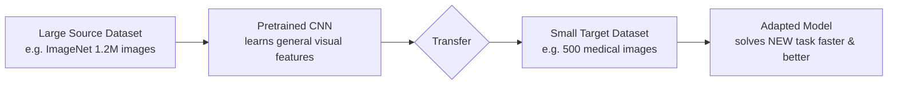
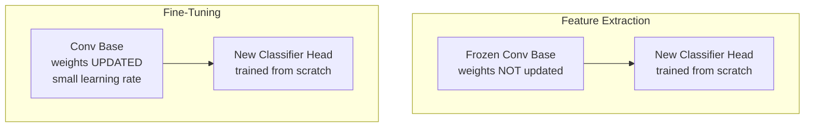
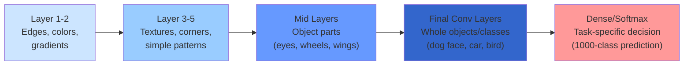
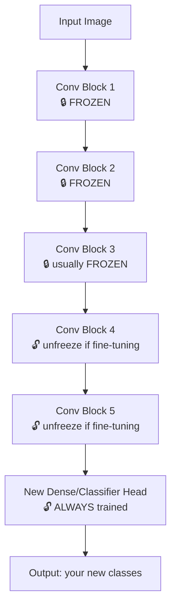
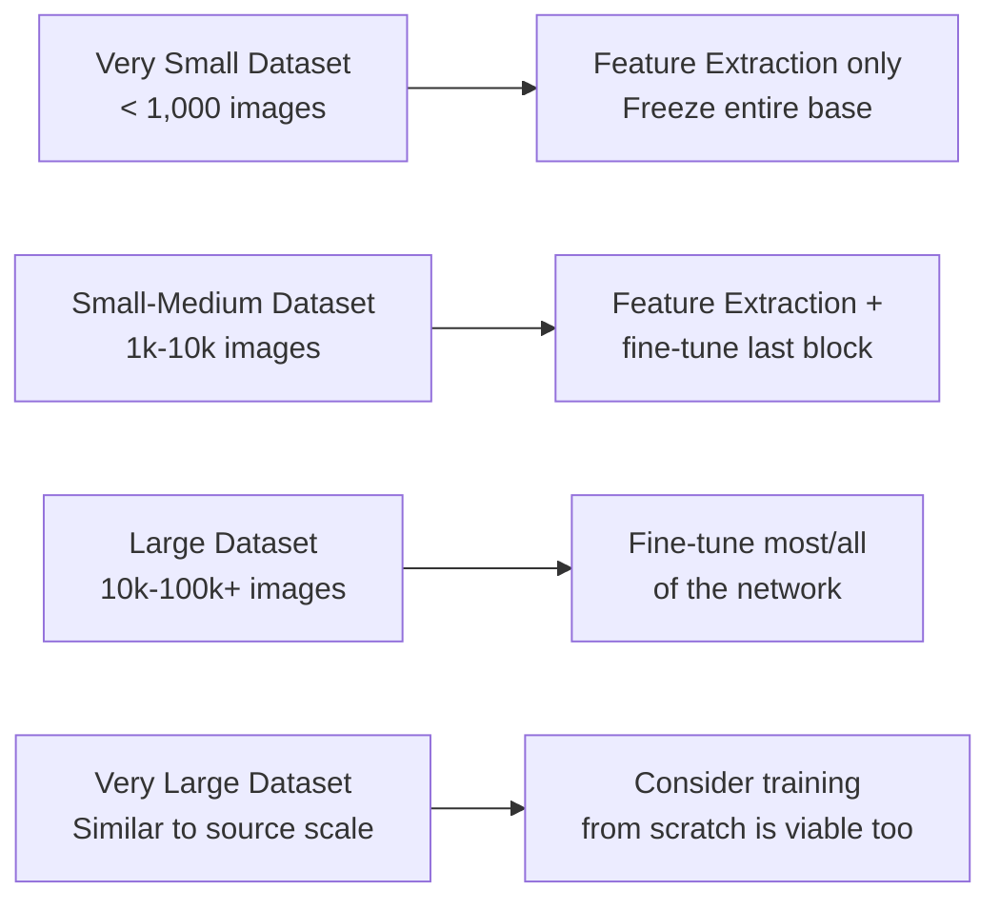
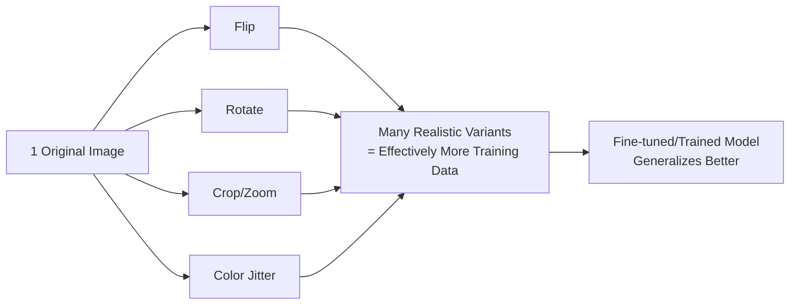

# Transfer Learning in CNNs

> [!abstract] Core Idea
> Instead of training a CNN **from scratch** (random weights, huge dataset, huge compute), we start from a network **already trained** on a large dataset (e.g. ImageNet, 1.2M images, 1000 classes) and **reuse** what it already learned for a **new, related task**.

---

## 1. What is Transfer Learning in CNNs?

Transfer learning = taking knowledge (weights/filters) learned while solving problem A (source task, e.g. classifying 1000 ImageNet objects) and reusing it to solve problem B (target task, e.g. classifying 3 types of skin lesions), instead of learning from zero.



**Why it works:** early visual patterns (edges, colors, textures, shapes) are *universal* across almost all natural images — you don't need to relearn "what an edge looks like" for every new problem.

**Why we use it:**
- Needs far less labeled data for the new task
- Trains much faster (fewer epochs, fewer parameters to update)
- Usually generalizes better than training from scratch, especially with small datasets
- Cheaper — no need for a GPU cluster and weeks of training

---

## 2. Feature Extraction vs Fine-Tuning

These are the **two main strategies** of transfer learning. Both start the same way (load a pretrained model), but differ in **how much of the network you let training touch**.



| | **Feature Extraction** | **Fine-Tuning** |
|---|---|---|
| Convolutional base | Frozen (weights locked) | Partially/fully unfrozen (weights updated) |
| What's trained | Only the new classifier head (dense layers) | Head + some (or all) convolutional layers |
| Speed | Fast (fewer parameters to update) | Slower |
| Data needed | Works well with very little data | Needs a bit more data to avoid overfitting |
| Risk | Underfitting if target task is very different from source | Overfitting or "catastrophic forgetting" if not careful |
| Analogy | Using the pretrained network purely as a **fixed feature/filter bank** | **Gently re-teaching** part of the network your new domain's specifics |

**Rule of thumb:** start with feature extraction. If accuracy plateaus and you have enough data, unfreeze the top layers and fine-tune with a **low learning rate** (e.g. 1e-5) so you don't destroy the pretrained weights.

---

## 3. What Features Do Pretrained CNNs Learn?

CNN layers learn a **hierarchy of features**, from simple to complex, stacking on top of each other:



This is the famous result popularized by Zeiler & Fergus (2014) visualizing CNN filters layer by layer — the deeper you go, the more abstract and class-specific the representations become.

---

## 4. Why Are Early Layers General and Later Layers Task-Specific?

- **Early layers** detect low-level statistical regularities of *natural images in general* (edges, gradients, color blobs, simple textures). A cat, a car, and an X-ray image all contain edges — so these filters transfer almost perfectly to any visual task.
- **Later layers** combine those low-level features into **high-level, semantic concepts** that are specific to the *classes the network was trained on* (e.g. "dog snout detector", "steering wheel detector"). These are tuned to the source task's exact categories and don't automatically make sense for a different task.

> [!tip] Mental Model
> Think of a CNN as a **funnel**: it starts broad and universal (physics of light and edges) and narrows into something very specific (the exact 1000 ImageNet categories). The narrow end is what you need to replace for a new task; the broad end you can keep.

---

## 5. Which Layers Should Be Frozen or Unfrozen?



**General guideline:**
- **Freeze**: early/general layers (edges, textures) — almost never need retraining.
- **Unfreeze (fine-tune)**: last few convolutional blocks — these hold task-specific semantics you want to adapt to your new classes.
- **Always train from scratch**: the final classification head, because your number of output classes is different from the source task.

---

## 6. How to Choose a Pretrained Model?

Ask these questions:

1. **How similar is my data to ImageNet (or the model's source data)?** Natural photos → most ImageNet backbones work great. Medical/satellite/audio-spectrogram images → less overlap, may need more fine-tuning or a domain-specific pretrained model.
2. **How much compute/latency budget do I have?** Mobile/edge → MobileNet, EfficientNet-lite. Server-side, accuracy-first → ResNet-152, EfficientNet-B7, ConvNeXt, ViT-based backbones.
3. **How much labeled data do I have?** Very little → favor smaller, more regularized backbones + feature extraction. More data → can afford larger backbones + deeper fine-tuning.
4. **Do I need interpretability / a well-documented architecture?** Simpler nets (VGG, ResNet) are easier to reason about than very deep, exotic architectures.

---

## 7. Common Pretrained CNN Architectures

| Architecture | Key Idea | Notes |
|---|---|---|
| **VGG16 / VGG19** | Simple stacks of 3x3 convolutions | Easy to understand, large, slow, many parameters |
| **ResNet (18/34/50/101/152)** | Residual/skip connections solve vanishing gradients | Extremely common transfer-learning backbone |
| **Inception (GoogLeNet) / InceptionV3** | Multi-scale filters processed in parallel ("inception module") | Efficient, good accuracy/compute tradeoff |
| **MobileNet (V1/V2/V3)** | Depthwise separable convolutions | Lightweight, great for mobile/edge devices |
| **EfficientNet** | Compound scaling of depth/width/resolution | State-of-the-art accuracy per FLOP |
| **DenseNet** | Every layer connected to every other layer (feature reuse) | Very parameter-efficient |
| **Xception** | "Extreme Inception" using depthwise separable convs | Strong ImageNet performance |

---

## 8. How Does Dataset Size Affect Transfer Learning?



- **Small dataset** → freeze almost everything. Fine-tuning too many parameters on too little data causes **overfitting** (the model memorizes instead of generalizing).
- **Larger dataset** → you can safely unfreeze more layers because there's enough data to update those weights without them collapsing into memorization.

---

## 9. How Does Feature Reuse Help Small Datasets?

With a small dataset, a randomly-initialized CNN simply doesn't see enough examples to learn good low-level filters (it needs thousands of images just to learn what an edge is, before it can even start learning what *your* classes look like). 

By **reusing** filters already learned from millions of images, you skip that entire "learning to see" phase and let your limited data budget go entirely into learning the last mile — how those general features combine into *your* specific classes. This is why transfer learning can achieve strong results with just hundreds of images per class where training from scratch would fail completely.

---

## 10. Why Fine-Tune Only Part of the Network?

- **Preserve general features**: early layers already encode near-universal patterns — retraining them risks *unlearning* useful, well-generalized filters ("catastrophic forgetting").
- **Fewer trainable parameters** = lower overfitting risk with limited data.
- **Faster & cheaper training**: fewer gradients to compute and store.
- **Stability**: pretrained weights sit in a good region of the loss landscape; aggressively updating all of them with a small dataset can push the model into a worse region.

---

## 11. Source–Target Dataset Similarity: How It Affects Performance

```mermaid
quadrantChart
    title Strategy by Dataset Size vs Similarity to Source
    x-axis Low Similarity --> High Similarity
    y-axis Small Dataset --> Large Dataset
    quadrant-1 Fine-tune most layers
    quadrant-2 Fine-tune deep layers carefully
    quadrant-3 Feature extraction (freeze all)
    quadrant-4 Fine-tune only last block
```

- **High similarity + small data** → freeze almost everything, train only a new classifier head (transfers cleanly).
- **High similarity + large data** → can fine-tune deeper since you have data to support it, though gains may be modest since features already fit well.
- **Low similarity + small data** → riskiest case; freeze most layers to avoid overfitting, but expect a performance ceiling since source features may not fully apply.
- **Low similarity + large data** → worth fine-tuning most/all layers, or even training from scratch, since you have enough data to relearn task-specific representations.

---

## 12. Overfitting and Transfer Learning

Overfitting = model memorizes training data instead of learning generalizable patterns; shows as great training accuracy but poor validation/test accuracy.

**Transfer learning connects to overfitting in two ways:**

1. **It reduces overfitting risk** compared to training from scratch, because you start from good, already-generalized weights instead of random ones — less "room" for the model to memorize noise before it even starts.
2. **It can still cause overfitting** if you:
 - Unfreeze too many layers relative to how much data you have
 - Use too high a learning rate during fine-tuning (destroys good pretrained weights)
 - Train for too many epochs without early stopping
 - Use a target dataset that's tiny and unrepresentative

**Mitigations:** freeze more layers, use dropout, use a low fine-tuning learning rate, early stopping, and data augmentation.

---

## 13. How Does Data Augmentation Help Transfer Learning?

Data augmentation (random crops, flips, rotations, color jitter, zoom, etc.) artificially expands your small target dataset by creating realistic variations of existing images.



Why it matters especially for transfer learning:
- Small target datasets are the exact scenario where transfer learning is used — augmentation directly compensates for that lack of volume.
- It **reduces overfitting**, especially important when you've unfrozen and are fine-tuning part of the pretrained network.
- It forces the model to learn features that are **invariant** to irrelevant changes (orientation, lighting, position) rather than memorizing exact pixels.
- It pairs naturally with fine-tuning: augment aggressively when the target dataset is small, and can ease off as your dataset (or number of unfrozen layers) grows.

---

## Quick Reference — Decision Cheatsheet

| Scenario | Strategy |
|---|---|
| Small dataset, similar to source domain | Feature extraction (freeze conv base, train new head) |
| Small dataset, different domain | Feature extraction + heavy augmentation; expect a ceiling |
| Large dataset, similar to source domain | Fine-tune top layers, maybe all, with low LR |
| Large dataset, different domain | Fine-tune most/all layers, or consider training from scratch |
| Always | Freeze early layers longer than late layers; use low LR when fine-tuning; use augmentation; monitor val loss for overfitting |

---

## Visual References
*(Search these terms if you want to paste specific diagrams into this note from your browser: "transfer learning feature extraction vs fine-tuning diagram", "CNN layer feature visualization Zeiler Fergus", "frozen vs trainable layers transfer learning architecture")*

---

## One-Sentence Summary Per Objective (for quick recall / flashcards)

- **Transfer learning**: reuse a model trained on task A to solve task B faster and with less data.
- **Feature extraction vs fine-tuning**: freeze everything and just train a new head, vs unfreezing some layers and gently retraining them too.
- **Choosing a pretrained model**: match architecture size/speed to your data size, compute budget, and domain similarity.
- **What pretrained CNNs learn**: a hierarchy from edges → textures → parts → whole objects.
- **Dataset size effect**: smaller data → freeze more; larger data → can unfreeze more.
- **Early vs late layers**: early = universal visual statistics; late = task-specific semantics.
- **Source-target similarity**: more similar domains transfer better with less fine-tuning needed.
- **Common architectures**: VGG, ResNet, Inception, MobileNet, EfficientNet, DenseNet, Xception.
- **Freezing choices**: freeze early general layers, unfreeze late task-specific layers, always train the new head.
- **Feature reuse & small data**: skips the "learning to see" phase, letting limited data focus on the final task-specific mapping.
- **Why fine-tune only part**: avoids catastrophic forgetting, reduces overfitting, saves compute.
- **Overfitting**: transfer learning generally reduces it, but aggressive fine-tuning on small data can reintroduce it.
- **Data augmentation**: artificially grows small datasets and reduces overfitting, especially valuable for fine-tuning stages.
