# Linear Models: Regression, Regularization, SHAP, Logistic Regression & SVMs

> [!abstract] Big Picture
> Linear models are the foundation of ML: they predict an output as a **weighted sum of input features**. This note covers **linear regression** (predicting continuous values), **regularization** (Ridge/Lasso, to prevent overfitting), **SHAP values** (explaining any model's predictions), **logistic regression** (predicting categories via linear models), and **SVMs** (finding the best-separating boundary, linear or non-linear via kernels).

---

# PART 1 — Linear Regression

## 1. What Are Linear Models?

A linear model predicts an output as a **weighted sum of the input features**, plus a bias/intercept term:

`ŷ = w₁x₁ + w₂x₂ + ... + wₙxₙ + b`

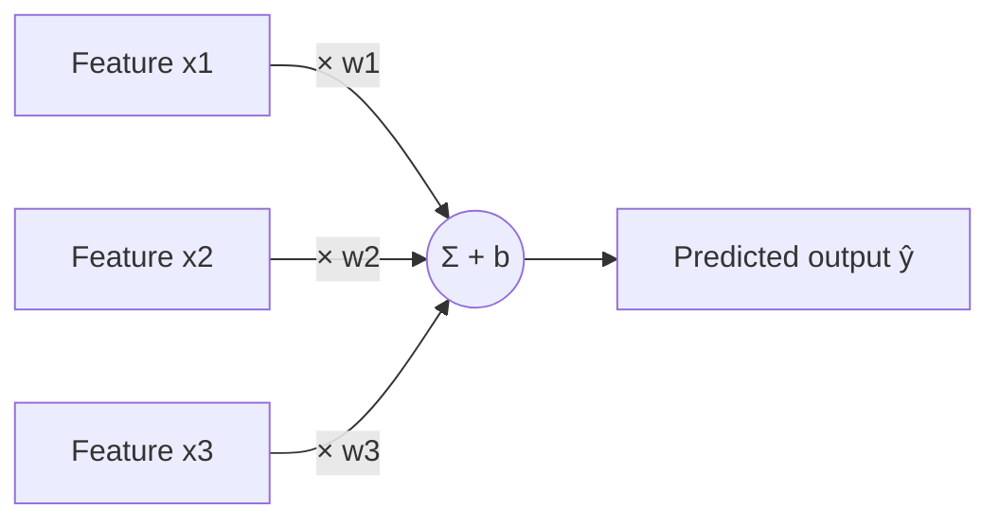

The model's job during training is to find the weights `w` (and bias `b`) that best fit the data — usually by minimizing a loss function like Mean Squared Error. Despite being simple, linear models are the backbone of **linear regression** (continuous output), **logistic regression** (classification), and even the final layer of many neural networks.

**Why they matter:** they're fast to train, easy to interpret (each weight directly tells you a feature's effect), and surprisingly competitive as a baseline before reaching for more complex models.

---

## 2. What is Linear Regression Used For in Machine Learning?

Linear regression predicts a **continuous numeric value** by fitting a straight line (or hyperplane, in higher dimensions) that best describes the relationship between input features and the target.

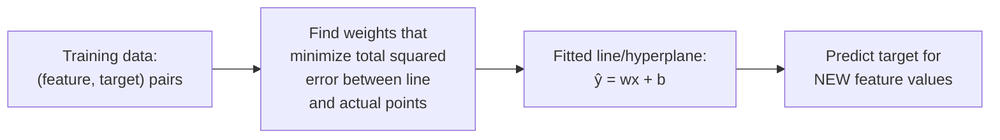

Common uses: predicting house prices from square footage, predicting sales from advertising spend, predicting a person's salary from years of experience — any problem where the output is a continuous number and the relationship is roughly linear (or can be made linear via feature engineering).

---

## 3. What Metrics Are Commonly Used to Evaluate Regression Models?

| Metric | Formula (intuition) | What it tells you |
|---|---|---|
| **MAE** (Mean Absolute Error) | Average of |actual − predicted| | Average error size in the original units; robust to outliers |
| **MSE** (Mean Squared Error) | Average of (actual − predicted)² | Penalizes large errors much more heavily than small ones (due to squaring) |
| **RMSE** (Root MSE) | √MSE | Same units as the target (unlike MSE), still penalizes large errors heavily |
| **R² (R-squared)** | 1 − (SS_residual / SS_total) | Proportion of variance in the target explained by the model; 1.0 = perfect fit, 0 = no better than predicting the mean |

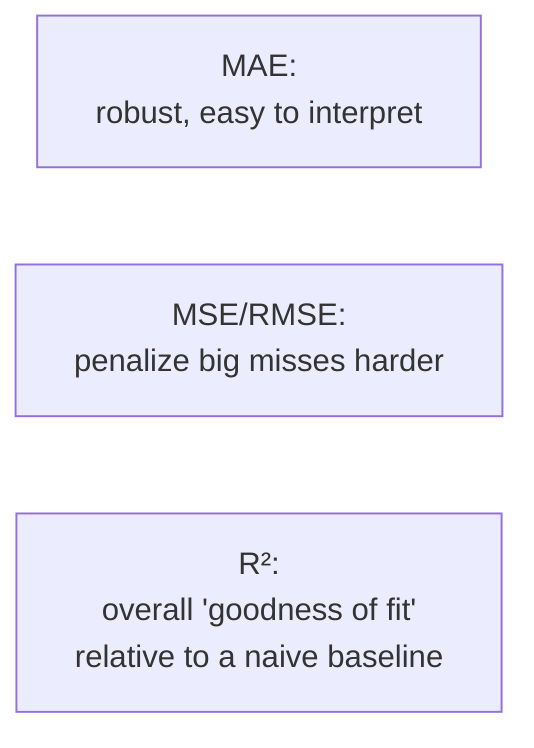

**Rule of thumb:** use RMSE when large errors are especially costly and you want the metric in the same units as the target; use MAE when you want a robust, easily-interpretable average error; use R² to communicate overall model quality as a single, scale-free number.

---

# PART 2 — Regularization: Ridge & Lasso

## 4. How Does Ridge Regression Help Prevent Overfitting?

Ridge regression adds an **L2 penalty** (sum of squared weights) to the loss function:

`Loss = MSE + λ × Σ(wᵢ²)`

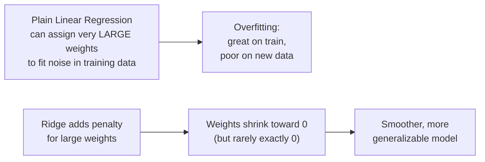

**Why it helps:** without a penalty, the model can chase down every fluctuation in the training data by assigning extreme weights to certain features, especially when features are correlated (multicollinearity) or there are more features than data points. The `λ` (alpha) penalty discourages any single weight from growing too large, producing a smoother decision function that's less sensitive to noise and generalizes better to unseen data. Ridge shrinks weights toward zero **smoothly** but essentially never sets them exactly to zero.

---

## 5. How Does Lasso Regression Perform Feature Selection?

Lasso regression adds an **L1 penalty** (sum of absolute weights) instead:

`Loss = MSE + λ × Σ|wᵢ|`

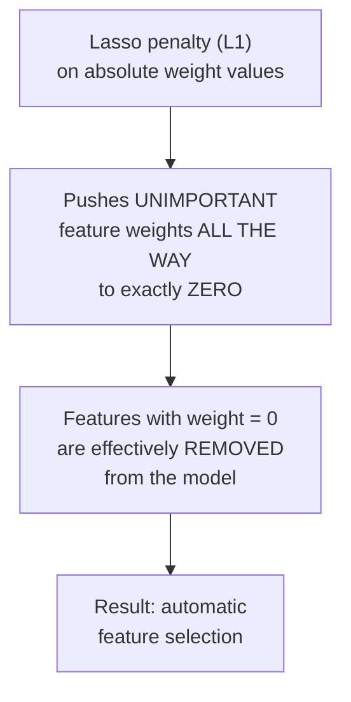

**Why L1 (not L2) can zero out weights:** geometrically, the L1 penalty's constraint region has sharp corners along the axes, and the optimal solution often lands exactly on one of those corners — meaning some weights become exactly zero. L2's constraint region is smooth/round (a circle/sphere), so its optimum rarely lands exactly on an axis — weights shrink but stay non-zero. This makes Lasso especially useful when you suspect many features are irrelevant and want the model to automatically identify and discard them, producing a sparser, more interpretable model.

> [!tip] Ridge vs Lasso
> Ridge: keeps all features, shrinks their influence — good when most features are somewhat useful. Lasso: can eliminate features entirely — good when you believe many features are noise. **Elastic Net** combines both L1+L2 penalties to get benefits of each.

---

# PART 3 — SHAP: Explaining Model Predictions

## 6. What Are SHAP Values, and How Do They Explain Model Predictions?

**SHAP (SHapley Additive exPlanations)** values assign each feature a **contribution score** for a specific prediction, based on Shapley values from cooperative game theory — answering: "how much did this particular feature push the prediction up or down, compared to the average prediction?"

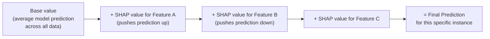

**How it works conceptually:** imagine the features are "players" cooperating to produce the prediction (like a game payout). SHAP fairly distributes the "credit" for the final prediction among all features by considering every possible order in which features could be added to the model and averaging each feature's marginal contribution across all those orderings. This gives values that are theoretically fair and always sum up exactly to (prediction − base value).

**Why it's useful:**
- Works on **any** model (tree-based, linear, even deep neural networks) — it's model-agnostic (with faster specialized versions for trees).
- Explains **individual predictions** (why did the model say THIS patient is high-risk?), not just overall feature importance.
- A **beeswarm plot** shows, for every data point, how each feature's value relates to its SHAP value (color = feature value, position = impact on prediction) — revealing whether high or low values of a feature push predictions up or down.
- A **bar plot** of mean absolute SHAP values gives a clean, global feature-importance ranking, similar in spirit to Random Forest feature importance but theoretically grounded and consistent across model types.

---

# PART 4 — Logistic Regression & Decision Boundaries

## 7. How is Logistic Regression Different From Linear Regression?

Despite the name, **logistic regression is a classification algorithm**, not a regression one. It takes the same linear combination of features as linear regression, but passes it through the **sigmoid (logistic) function** to squash the output into a probability between 0 and 1.

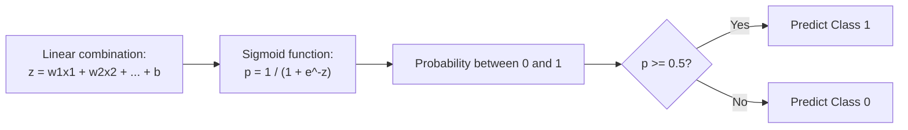

| | **Linear Regression** | **Logistic Regression** |
|---|---|---|
| Output type | Continuous number (any real value) | Probability (0 to 1), then thresholded into a class |
| Output shape | Straight line/hyperplane | S-shaped sigmoid curve |
| Loss function | Mean Squared Error | Log loss / Binary Cross-Entropy |
| Use case | Predicting a numeric value | Predicting a category (yes/no, spam/not-spam) |

---

## 8. What is a Decision Boundary in Classification Models?

A **decision boundary** is the surface in feature space where a classifier's predicted class **switches** from one to another — points on one side are predicted as Class A, points on the other side as Class B.

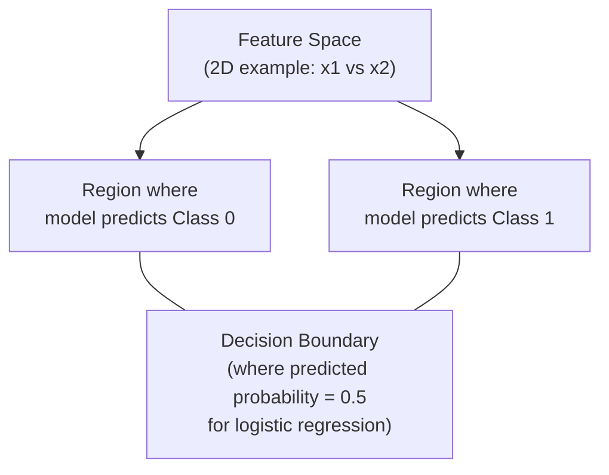

For **logistic regression**, the decision boundary is exactly where predicted probability = 0.5, which corresponds to a straight **line** (in 2D) or **hyperplane** (in higher dimensions), since the underlying model is linear. More complex models (SVM with non-linear kernels, decision trees, neural nets) can produce curved, non-linear decision boundaries. Visualizing the decision boundary (when you have 2-3 features, or after dimensionality reduction) is one of the best ways to build intuition for how a classifier is actually "thinking."

---

# PART 5 — Support Vector Machines

## 9. What is a Support Vector Machine (SVM) and How Does it Work?

An SVM finds the decision boundary (hyperplane) that **maximizes the margin** — the distance between the boundary and the nearest data points from each class (called the **support vectors**).

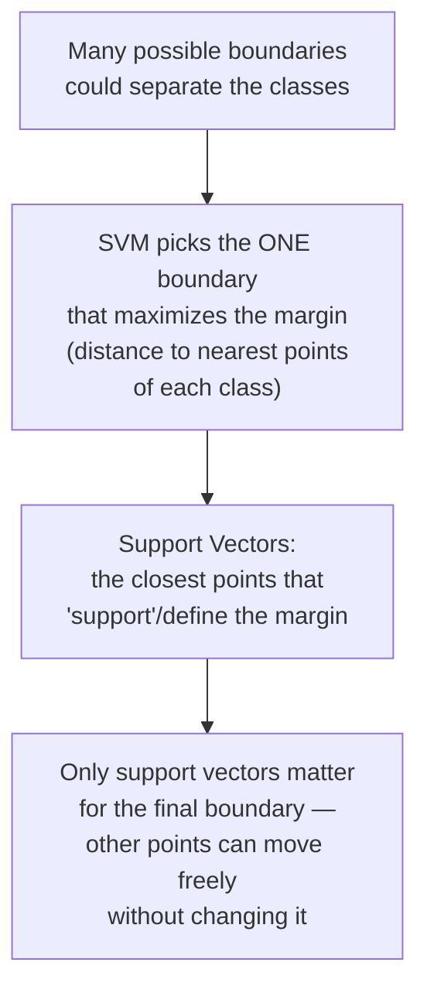

**Why maximize the margin?** A wider margin means the boundary sits as far as possible from both classes, giving the model more "breathing room" and typically better generalization to new data than a boundary that barely squeezes between the classes. Only the support vectors (points closest to the boundary) actually determine where the boundary sits — this makes SVMs relatively memory-efficient at prediction time, since the rest of the training data can technically be discarded.

For data that isn't perfectly separable, a **soft margin** (controlled by hyperparameter `C`) allows some points to violate the margin or even be misclassified, trading off margin width against classification errors.

---

## 10. How Do Different Kernels (Linear, Poly, RBF) Affect SVM Performance?

Raw SVMs only find **linear** boundaries. **Kernels** let SVMs find non-linear boundaries by implicitly mapping data into a higher-dimensional space where a linear separator *does* exist — without ever explicitly computing that high-dimensional transformation (the "kernel trick").

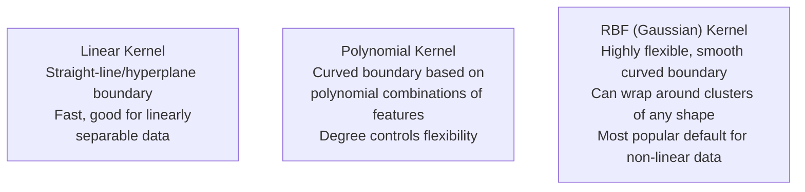

| Kernel | Boundary shape | When to use |
|---|---|---|
| **Linear** | Straight line/hyperplane | Data is (roughly) linearly separable, or you have very high-dimensional data (e.g. text) where linear already works well |
| **Polynomial** | Curved, defined by a polynomial degree | Moderate non-linearity, when you have some domain reason to believe polynomial feature interactions matter |
| **RBF (Radial Basis Function)** | Very flexible, smooth curved boundaries, can isolate clusters | Default choice for most non-linear problems — powerful, fewer assumptions about data shape |

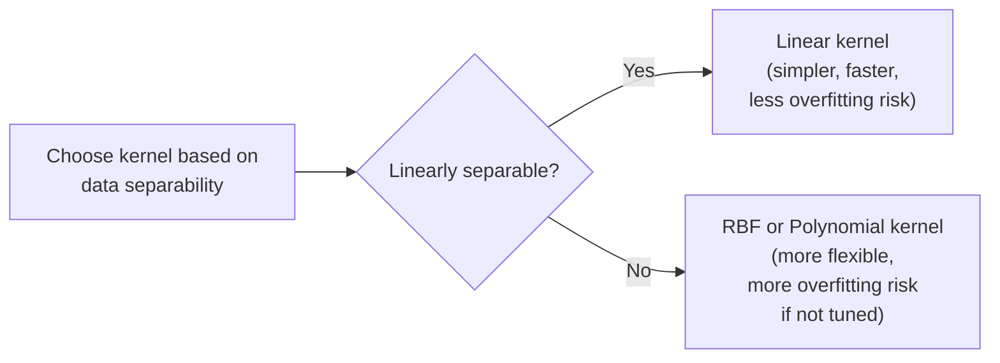

**Trade-off:** more flexible kernels (RBF, high-degree polynomial) can fit more complex boundaries but risk **overfitting** if not properly regularized (via `C` and kernel-specific parameters like `gamma` for RBF). A higher `gamma` makes RBF boundaries tighter/more wiggly around individual points (higher overfitting risk); a lower `gamma` makes boundaries smoother.

---

## 11. How Do You Evaluate Classification Models Effectively?

A single accuracy number is often **not enough**, especially with imbalanced classes. A complete evaluation typically combines:

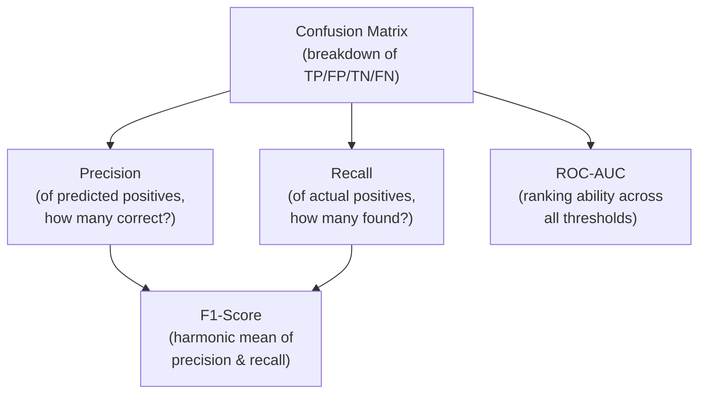

| Metric | Best used when |
|---|---|
| **Accuracy** | Classes are roughly balanced |
| **Precision** | False positives are costly |
| **Recall** | False negatives are costly |
| **F1-score** | You need one balanced number, especially with imbalanced classes |
| **ROC-AUC** | Comparing models' overall ranking ability, independent of a specific threshold |
| **Confusion Matrix** | You want to see the exact type/count of every error the model makes |

**Practical approach:** always look at the confusion matrix first to understand *what kind* of mistakes the model makes, then choose the metric(s) that match the real-world cost of those specific mistakes — a medical screening tool and a spam filter should absolutely NOT be evaluated with the same metric priorities.

---

## Quick Reference — One-Sentence Summary Per Objective

- **Linear models**: predict an output as a weighted sum of input features plus a bias term.
- **Linear regression**: fits a line/hyperplane to predict a continuous numeric target.
- **Regression metrics**: MAE (robust average error), MSE/RMSE (penalize large errors more), R² (variance explained).
- **Ridge regression**: adds an L2 penalty on squared weights, shrinking them smoothly to reduce overfitting.
- **Lasso regression**: adds an L1 penalty on absolute weights, which can shrink some weights exactly to zero, performing automatic feature selection.
- **SHAP values**: fairly distribute credit for a prediction among features using game-theory principles, explaining individual predictions for any model.
- **Logistic vs linear regression**: logistic regression passes a linear combination through a sigmoid to output a class probability, instead of a continuous value.
- **Decision boundary**: the surface in feature space where a classifier's predicted class switches — linear for logistic regression/linear SVM, curved for non-linear models.
- **Support Vector Machine**: finds the boundary that maximizes the margin between classes, defined by the closest points (support vectors).
- **SVM kernels**: linear kernels give straight boundaries; polynomial and RBF kernels implicitly map data to higher dimensions to capture non-linear boundaries, trading flexibility for overfitting risk.
- **Evaluating classifiers**: combine accuracy, precision, recall, F1, confusion matrix, and ROC-AUC — choosing which to prioritize based on the real-world cost of false positives vs false negatives.
