# Tree-Based Methods: Decision Trees, Random Forests & Boosting

> [!abstract] Big Picture
> A **single decision tree** is simple and interpretable but tends to overfit. **Ensemble methods** combine many trees to fix this — either by averaging many independent trees trained on random variations of the data (**bagging** → Random Forest), or by building trees **sequentially**, each one correcting the mistakes of the last (**boosting** → AdaBoost, Gradient Boosting, XGBoost, LightGBM).

---

# PART 1 — Decision Trees

## 1. What is a Decision Tree Classifier?

A decision tree is a flowchart-like model that makes predictions by asking a series of **yes/no questions about feature values**, splitting the data at each question, until it reaches a final decision (a leaf node = predicted class).

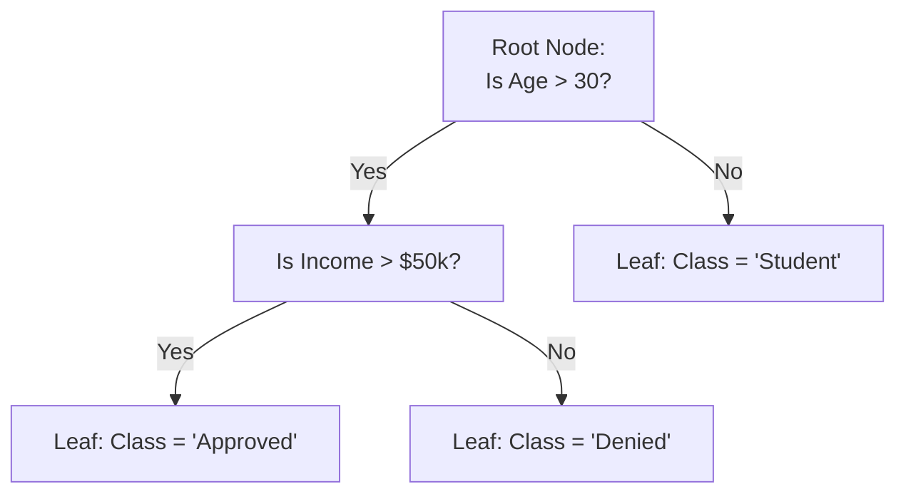

Each internal node tests one feature against a threshold; each branch is an outcome of that test; each leaf is a final predicted class (or, for regression, a predicted value). Trees are prized for being **interpretable** — you can literally trace the path of if/then rules that led to any prediction.

---

## 2. How Do Decision Trees Make Splits?

At each node, the tree tries **every possible feature and threshold**, and picks the split that makes the resulting child nodes as **"pure"** as possible (i.e. each child contains mostly one class).

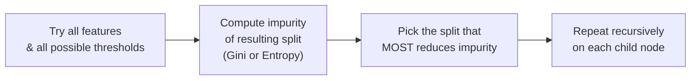

Two common impurity measures:

| Measure | Formula (intuition) | Idea |
|---|---|---|
| **Gini Impurity** | 1 − Σ(pᵢ²) | Probability of misclassifying a randomly picked point if labeled randomly according to the class distribution in that node |
| **Entropy** | −Σ(pᵢ × log₂(pᵢ)) | Information-theoretic measure of "disorder"; splits are chosen to maximize **information gain** (entropy reduction) |

Both measures reach 0 when a node is perfectly pure (all one class) and are highest when classes are evenly mixed. The tree greedily picks, at every node, whichever single split reduces impurity the most — this is a **greedy, locally-optimal** algorithm (it doesn't look ahead to guarantee a globally optimal tree).

---

## 3. Pre-Pruning vs. Post-Pruning

Left unchecked, a decision tree will keep splitting until every leaf is 100% pure — usually meaning it has **memorized the training data** (severe overfitting, tiny leaves with 1-2 samples each).

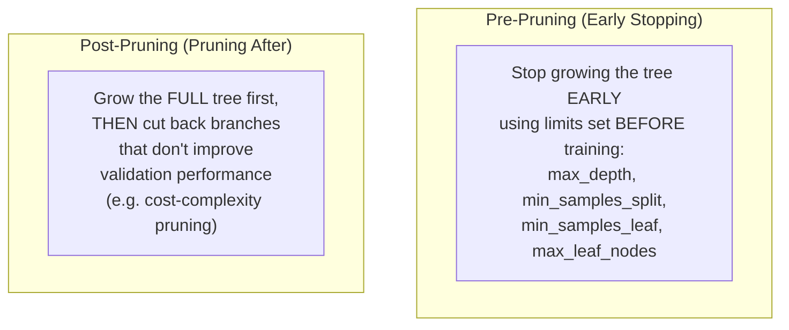

| | **Pre-Pruning** | **Post-Pruning** |
|---|---|---|
| When it acts | During training, stops splits early | After training, removes branches from a full tree |
| How | Hyperparameters: `max_depth`, `min_samples_split`, `min_samples_leaf` | Cost-complexity pruning (`ccp_alpha`), reduced-error pruning |
| Risk | Might stop too early, missing genuinely useful splits (underfitting) | More computationally expensive (grow full tree first), but usually more thorough |
| Common use | Quick, simple regularization | Preferred when you want a more principled, data-driven pruning decision |

---

## 4. What is `ccp_alpha` in Pruning?

**Cost-Complexity Pruning (CCP)** is a post-pruning method that balances a tree's accuracy against its complexity (number of leaves) using a single parameter, **`ccp_alpha`** (also called the complexity parameter).

For any subtree, its "cost" is defined as:

`Cost = (Impurity/Error of the tree) + ccp_alpha × (Number of leaves)`

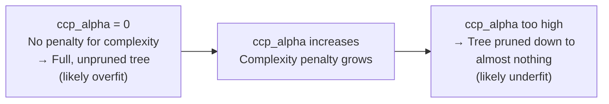

- `ccp_alpha = 0` → no penalty for having many leaves → the full, unpruned (likely overfit) tree is kept.
- **Increasing `ccp_alpha`** makes the algorithm prefer smaller trees, pruning away branches whose accuracy improvement isn't "worth" the added complexity.
- In practice, you compute the **cost-complexity pruning path** (`cost_complexity_pruning_path`) to get a range of candidate `ccp_alpha` values, train a tree for each, and pick the `ccp_alpha` that gives the best **validation** performance (via cross-validation, e.g. `GridSearchCV`) — balancing bias and variance.

---

# PART 2 — Random Forests (Bagging)

## 5. How Does a Random Forest Improve Over a Single Tree?

A single decision tree is **high variance** — small changes in the training data can produce a very different tree, and fully-grown trees tend to overfit. A **Random Forest** builds **many trees** and averages their predictions, which cancels out each individual tree's noise/overfitting.

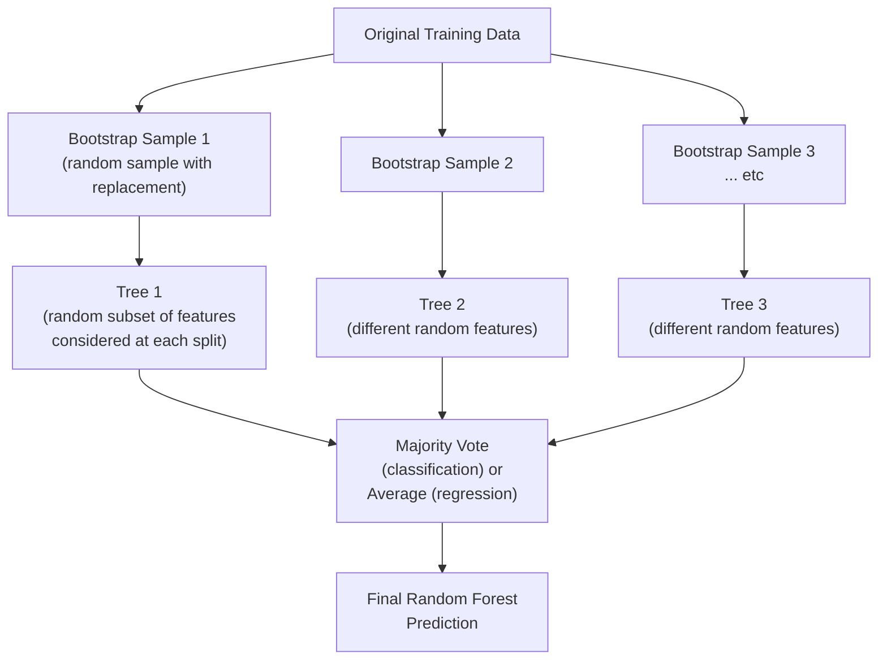

Two sources of randomness make each tree different (and their errors uncorrelated):
1. **Bagging (Bootstrap Aggregating)**: each tree trains on a different random sample of the training data (drawn *with replacement*).
2. **Random feature subsets**: at each split, only a random subset of features is considered (not all of them), which further decorrelates the trees.

**Why averaging many decorrelated trees helps:** individual trees' errors tend to be somewhat random/uncorrelated, so when you average many of them, the errors partially cancel out while the true signal (which all trees pick up on) reinforces — resulting in lower variance and better generalization than any single tree.

---

## 6. What is Feature Importance in Random Forests?

Feature importance quantifies **how much each feature contributes** to the model's predictions, aggregated across all trees in the forest.

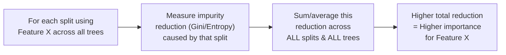

The most common method (**Mean Decrease in Impurity**, MDI) sums up how much each feature reduces impurity every time it's used for a split, across every tree, then normalizes so importances sum to 1. Features used often, and that produce big impurity reductions when used, get high importance scores. This is extremely useful for **interpretability** — understanding which inputs actually drive the model's decisions — and for **feature selection** (dropping consistently low-importance features).

---

# PART 3 — Boosting

## 7. What is Boosting?

Boosting is an ensemble technique that builds trees **sequentially**, where each new tree focuses specifically on **correcting the mistakes** of the trees built before it — as opposed to bagging's independent, parallel trees.

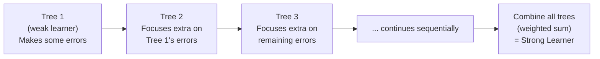

Each individual tree in boosting is usually a **weak learner** (shallow, e.g. depth 1-3 "stumps") — individually not very accurate, but the sequence of trees, each correcting the last, combines into a very strong overall model.

---

## 8. How Does AdaBoost Differ From Gradient Boosting?

Both are boosting algorithms (sequential, error-correcting), but they differ in **how** each new tree targets the previous errors:

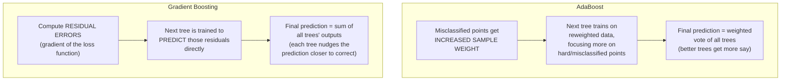

| | **AdaBoost** | **Gradient Boosting** |
|---|---|---|
| What changes each round | **Sample weights** — misclassified points get boosted weight | **Target values** — each new tree fits the residual errors (gradient of the loss) |
| How trees combine | Weighted vote/sum, weighted by each tree's accuracy | Additive sum of predictions, each tree correcting the running total |
| Flexibility | Originally designed for classification with exponential loss | Generalizes to any differentiable loss function (regression, classification, ranking, etc.) — more flexible |
| Typical base learner | Very shallow trees ("decision stumps", depth 1) | Slightly deeper shallow trees (depth 3-8 common) |

---

## 9. What Are XGBoost and LightGBM?

Both are **optimized, production-grade implementations of gradient boosting**, adding engineering and algorithmic improvements on top of the classic Gradient Boosting idea:

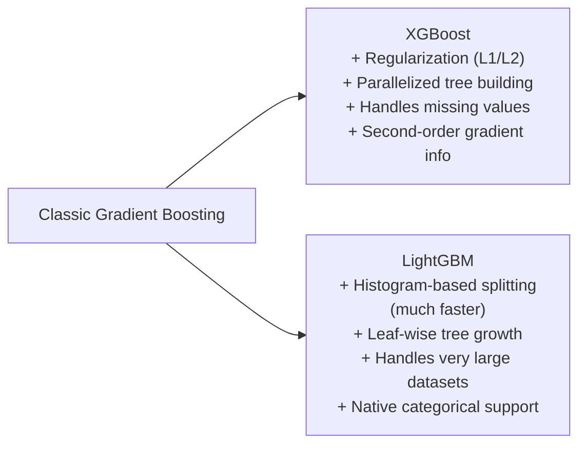

| | **XGBoost** | **LightGBM** |
|---|---|---|
| Tree growth | Level-wise (grows all nodes at a given depth before going deeper) | Leaf-wise (always splits the leaf that reduces loss the most, regardless of depth) — can be faster and more accurate, but more prone to overfitting on small data |
| Speed on large data | Fast, but generally slower than LightGBM at scale | Very fast, especially on large datasets (histogram-based binning of features) |
| Memory usage | Higher | Lower — more memory-efficient |
| Regularization | Built-in L1/L2 regularization on leaf weights | Also supports L1/L2, plus additional leaf-wise controls (e.g. `num_leaves`) |
| Categorical features | Needs manual encoding (typically) | Native support for categorical features without manual one-hot encoding |
| Best for | Robust, well-understood default choice for tabular data of moderate size | Very large datasets, tighter compute/memory budgets, faster iteration |

Both consistently rank among the top-performing algorithms for structured/tabular data competitions and production systems.

---

## 10. Bagging vs. Boosting — The Core Ensemble Difference

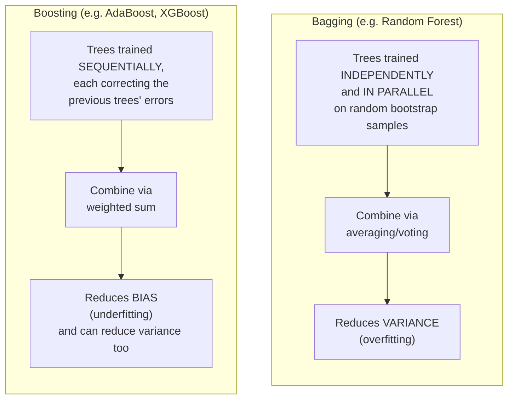

| | **Bagging** | **Boosting** |
|---|---|---|
| Tree training | Parallel, independent trees | Sequential, each tree depends on the previous |
| Data sampling | Random bootstrap samples (with replacement) | Full dataset each round, but reweighted or refit on residuals |
| Primary goal | Reduce **variance** (stabilize a high-variance base model) | Reduce **bias** (turn weak learners into a strong learner), often reduces variance too |
| Base learner | Usually deep/fully-grown trees | Usually shallow, weak trees ("stumps") |
| Overfitting risk | Lower (averaging is stabilizing) | Higher if too many rounds/too complex trees — needs careful tuning (learning rate, early stopping, regularization) |
| Example algorithms | Random Forest, Bagged Trees | AdaBoost, Gradient Boosting, XGBoost, LightGBM |

*(There's also **Stacking**: training a separate "meta-model" to learn how to best combine the predictions of several different base models — a third ensemble strategy distinct from both bagging and boosting.)*

---

## 11. How Do You Evaluate Classifier Performance?

| Metric | What it measures | When it matters most |
|---|---|---|
| **Accuracy** | Fraction of correct predictions | Balanced classes only — misleading on imbalanced data |
| **Precision** | Of predicted positives, how many were actually positive | When false positives are costly (e.g. spam filter blocking real email) |
| **Recall (Sensitivity)** | Of actual positives, how many were correctly found | When false negatives are costly (e.g. missing a disease diagnosis) |
| **F1-Score** | Harmonic mean of precision and recall | Good single number when you need a balance of both, especially on imbalanced data |
| **Confusion Matrix** | Full breakdown: true/false positives/negatives | Diagnosing exactly *what kind* of errors the model makes |
| **ROC-AUC** | Model's ability to rank positives above negatives across all thresholds | Comparing overall discriminative power, threshold-independent |

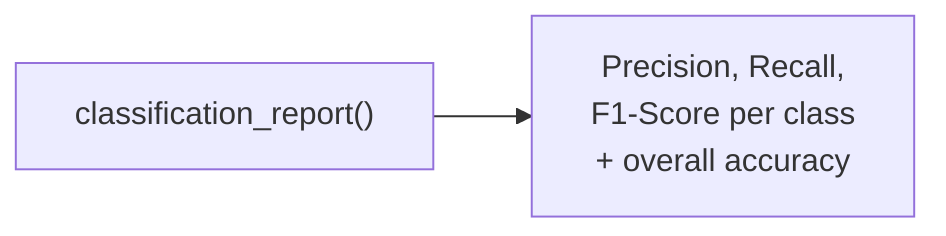

`classification_report` (scikit-learn) is the standard quick way to see precision/recall/F1 broken down per class in one call, alongside overall accuracy — essential for catching problems that a single accuracy number would hide, especially with imbalanced classes.

---

## Quick Reference — One-Sentence Summary Per Objective

- **Decision tree classifier**: a flowchart of if/then feature-threshold questions ending in class-predicting leaves.
- **How trees make splits**: greedily choose the feature/threshold that most reduces impurity (Gini or Entropy) at each node.
- **Pre-pruning vs post-pruning**: pre-pruning stops tree growth early with limits; post-pruning grows a full tree then cuts back branches afterward.
- **ccp_alpha**: a complexity penalty that trades off tree accuracy against number of leaves during cost-complexity post-pruning.
- **Random Forest improvement**: averages many decorrelated trees (via bootstrap sampling + random feature subsets) to reduce the variance/overfitting of a single tree.
- **Feature importance**: quantifies how much each feature reduces impurity across all splits and trees in the forest.
- **Boosting**: builds trees sequentially, each one correcting the errors of the previous trees.
- **AdaBoost vs Gradient Boosting**: AdaBoost reweights misclassified samples; Gradient Boosting fits new trees directly to the residual errors (gradient of the loss).
- **XGBoost and LightGBM**: optimized, regularized, faster gradient boosting implementations — XGBoost grows trees level-wise, LightGBM grows leaf-wise and scales better to huge datasets.
- **Bagging vs boosting**: bagging trains trees independently/in parallel to reduce variance; boosting trains trees sequentially to reduce bias (and often variance too).
- **Evaluating classifiers**: use accuracy, precision, recall, F1, confusion matrix, and ROC-AUC together — not accuracy alone, especially with imbalanced classes.
