# Unsupervised Learning: PCA, K-Means & Agglomerative Clustering

> [!abstract] Big Picture
> Unsupervised learning finds **structure in data with no labels**. This note covers the two big families of techniques: **dimensionality reduction** (PCA — compress features while keeping the important information) and **clustering** (K-Means, Agglomerative — group similar data points together), plus how to properly prepare data and evaluate the results.

---

# PART 1 — Unsupervised Learning Foundations

## 1. What is Unsupervised Learning?

Unsupervised learning trains a model on data that has **no labels/target values** — the algorithm's job is to discover patterns, structure, or groupings hidden in the data by itself, rather than predicting a known answer.

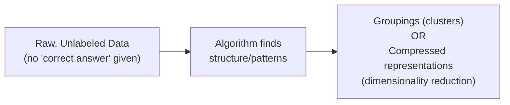

Common tasks: **clustering** (group similar items), **dimensionality reduction** (compress features), **anomaly detection** (find outliers), **association rules** (find co-occurring items).

---

## 2. How Does Unsupervised Learning Differ From Supervised Learning?

| | **Supervised Learning** | **Unsupervised Learning** |
|---|---|---|
| Labels | Requires labeled data (input → known correct output) | No labels needed |
| Goal | Learn a mapping from input to a known target (classification/regression) | Discover hidden structure (clusters, compressed representations) |
| Evaluation | Compare predictions to ground truth (accuracy, MSE, etc.) | No ground truth — evaluated with internal metrics (e.g. Silhouette Score) or domain judgment |
| Example | Predict house price from features | Group customers into segments with similar behavior |

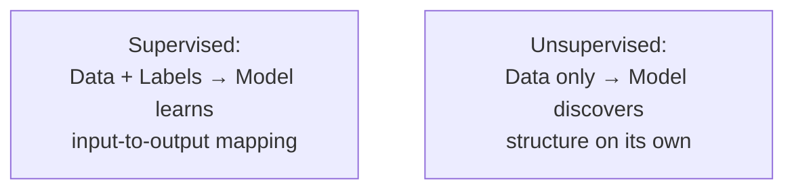

---

## 3. Why Standardize Data Before Clustering?

Clustering algorithms (K-Means, Agglomerative) rely on **distance calculations** (e.g. Euclidean distance) between points. If features are on very different scales (e.g. "income" in the tens of thousands vs "age" in single/double digits), the large-scale feature will **dominate** the distance calculation, effectively drowning out the smaller-scale feature — even if that smaller feature is actually more informative for finding real groupings.

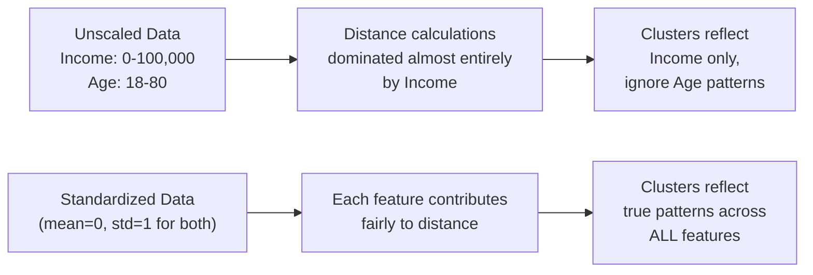

**Standardization** (e.g. `StandardScaler`: subtract mean, divide by standard deviation) puts every feature on a comparable scale (mean 0, std 1), so distance-based algorithms treat all features fairly regardless of their original units.

---

# PART 2 — Dimensionality Reduction & PCA

## 4. What is Dimensionality Reduction and Why is it Useful?

Dimensionality reduction compresses data from many features (dimensions) down to fewer, while trying to **preserve as much important information as possible**.

**Why it's useful:**
- Fights the **"curse of dimensionality"** — distance-based methods (like clustering) become less meaningful as dimensions grow, since points spread out and start looking equally far apart from each other.
- Speeds up training and reduces memory usage.
- Removes redundant/correlated features and noise.
- Enables **visualization** of high-dimensional data in 2D/3D.
- Can improve clustering/classification results by removing irrelevant variance.

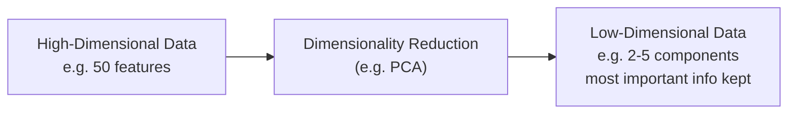

---

## 5. What is PCA and How Does it Help With Dimensionality Reduction?

**Principal Component Analysis (PCA)** finds new axes (called **principal components**) that are linear combinations of the original features, ordered so that the **first component captures the most variance** in the data, the second captures the next most (while being perpendicular/uncorrelated to the first), and so on.

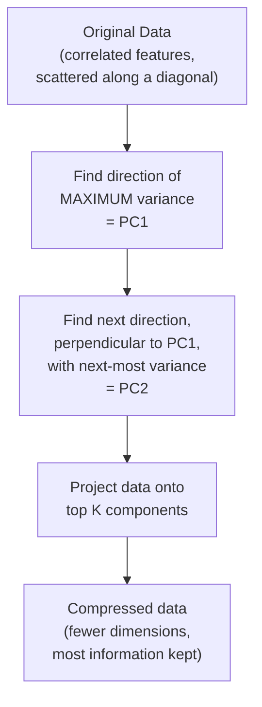

**How it helps with dimensionality reduction:** since the first few components typically capture the vast majority of the data's variance (its "spread" / information content), you can keep just those top components and **discard the rest**, shrinking the number of dimensions while losing only a small, controllable amount of information.

---

## 6. What is Explained Variance in PCA and Why Does it Matter?

**Explained variance** = how much of the total variance (spread/information) in the original data is captured by each principal component. It's usually expressed as a percentage of total variance.

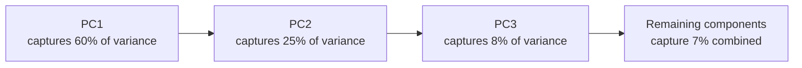

A **scree plot** (explained variance vs. number of components) helps you decide how many components to keep — typically look for the "elbow" where adding more components stops meaningfully increasing cumulative explained variance (e.g. keep enough components to explain 90-95% of total variance).

**Why it matters:** it directly quantifies the trade-off you're making — "I reduced from 50 features to 5, but I kept 93% of the original information" — so you can decide if the compression is worth the (small) information loss.

---

# PART 3 — K-Means Clustering

## 7. What is K-Means Clustering and How Does it Work?

K-Means partitions data into **K groups (clusters)**, where each point belongs to the cluster whose **centroid** (center point) is closest to it. It's an iterative algorithm:

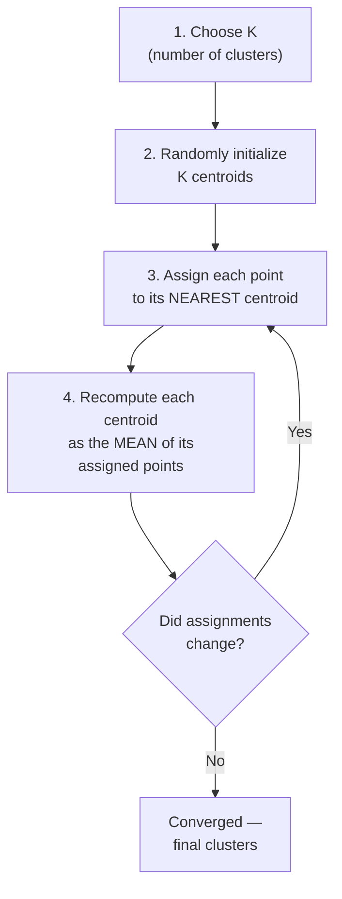

The algorithm alternates between **assignment** (label each point to its closest centroid) and **update** (move each centroid to the average position of its assigned points) until the assignments stop changing (convergence).

---

## 8. What Are Cluster Centroids?

A **centroid** is the "center of mass" of a cluster — literally the mean position (average of all coordinate values) of every point currently assigned to that cluster.

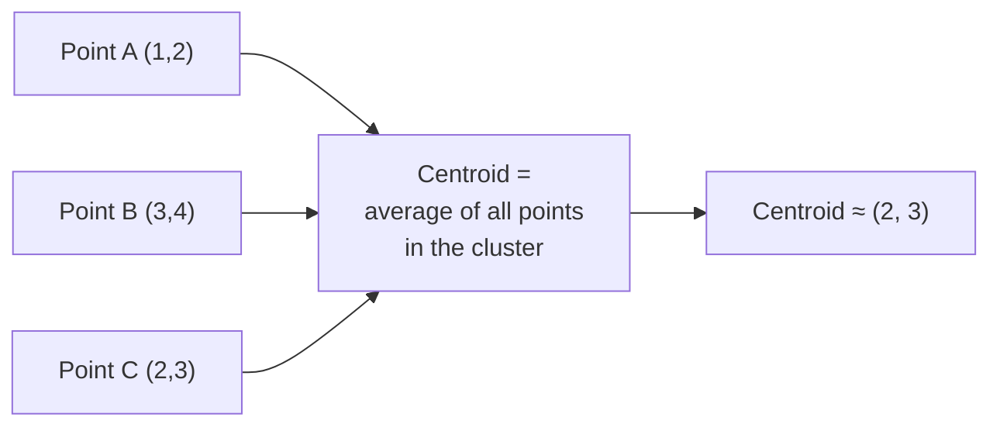

Centroids aren't necessarily real data points — they're a computed average, representing the "typical" location of that cluster. K-Means' whole objective is to find centroid positions that **minimize the total squared distance** between each point and its assigned centroid (called **inertia** or within-cluster sum of squares).

---

## 9. What is the Elbow Method and What is it Used For?

K-Means requires you to **choose K in advance** — but the "right" K usually isn't known ahead of time. The **Elbow Method** helps pick a reasonable K by plotting **inertia** (total within-cluster distance) against different values of K.

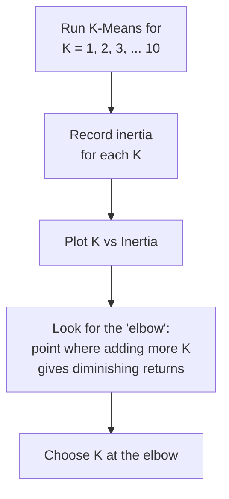

Inertia always decreases as K increases (more clusters = points closer to their own centroid), but after a certain point, adding more clusters gives only a marginal improvement — that "bend" in the curve (looking like an elbow) suggests a good balance between cluster quality and simplicity.

---

## 10. How Do You Evaluate the Quality of Clusters?

Since there are no true labels in unsupervised learning, cluster quality is measured with **internal metrics** that look at how well-separated and compact the clusters are:

| Metric | What it measures |
|---|---|
| **Inertia** (within-cluster sum of squares) | How tight/compact clusters are — lower is more compact, but always decreases with more clusters (needs the elbow method) |
| **Silhouette Score** | How well-separated clusters are relative to their own compactness — combines both cohesion and separation into one score |
| **Davies-Bouldin Index** | Average similarity between each cluster and its most similar one — lower is better |
| **Visual inspection** (via PCA/t-SNE 2D projection) | Human judgment of whether groupings look sensible |

---

## 11. What Does the Silhouette Score Indicate About Clusters?

The Silhouette Score measures, for each point, how similar it is to its **own cluster** compared to the **next-nearest cluster**. It ranges from **-1 to +1**:

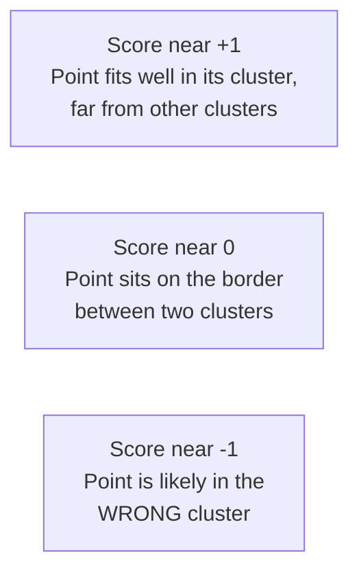

Formula (per point): `s = (b − a) / max(a, b)`, where `a` = average distance to points in its own cluster, `b` = average distance to points in the nearest other cluster.

The **overall Silhouette Score** is the average across all points — higher average scores indicate tighter, better-separated clusters. It's often used *alongside* the Elbow Method to double-check the chosen K, since it directly measures separation quality rather than just raw compactness.

> [!tip] Elbow vs Silhouette
> The Elbow Method looks at compactness only (and its "elbow" can be ambiguous). Silhouette Score balances compactness AND separation, giving a single, more decisive number for comparing different K values — many practitioners use Silhouette as the deciding factor when the elbow isn't clear.

---

# PART 4 — Agglomerative (Hierarchical) Clustering

## 12. What is Hierarchical (Agglomerative) Clustering?

Agglomerative clustering is a **bottom-up** approach: it starts with **every point as its own cluster**, then repeatedly **merges the two closest clusters** together, one pair at a time, until only one giant cluster remains (or until you stop at a desired number of clusters).

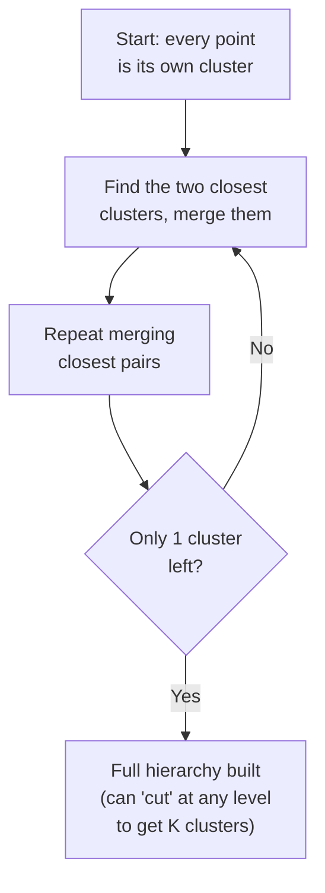

Unlike K-Means, you don't need to choose K upfront — you build the *entire* hierarchy of merges, then decide afterward at what level to "cut" it to get your desired number of clusters.

---

## 13. What is a Dendrogram and How Can it Help Interpret Clusters?

A **dendrogram** is a tree diagram visualizing the entire merge history of agglomerative clustering — each merge is drawn as a horizontal line joining two branches, at a height representing the **distance** at which they were merged.

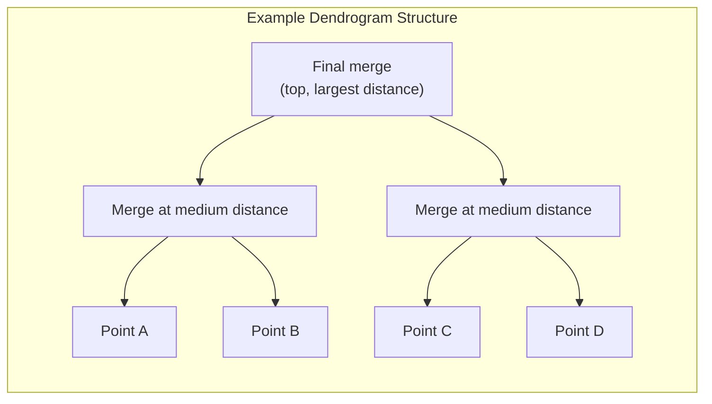

**How it helps interpretation:**
- **Cutting the tree horizontally** at any height gives you a specific number of clusters — cut low for many small clusters, cut high for few large clusters.
- **Tall vertical lines** (long branches before a merge) indicate that the merged clusters were quite *dissimilar* — a natural place to "cut" is often just below the tallest gap, since it separates genuinely distinct groups.
- Unlike K-Means, you get to *see* the full nested structure of similarity, rather than being locked into one flat K upfront.

---

## 14. What Are Linkage Methods in Hierarchical Clustering?

**Linkage** defines *how* the distance between two clusters (not just two points) is measured, which determines which pair gets merged next.

| Linkage | How distance between clusters is defined | Tendency |
|---|---|---|
| **Single linkage** | Minimum distance between any pair of points (one from each cluster) | Can produce long, "chained" clusters; sensitive to noise/outliers |
| **Complete linkage** | Maximum distance between any pair of points | Produces more compact, evenly-sized clusters |
| **Average linkage** | Average distance across all pairs of points between clusters | Balanced compromise between single and complete |
| **Ward's linkage** | Merges the pair that causes the smallest increase in total within-cluster variance | Tends to produce clusters similar in size and very compact; most common default |

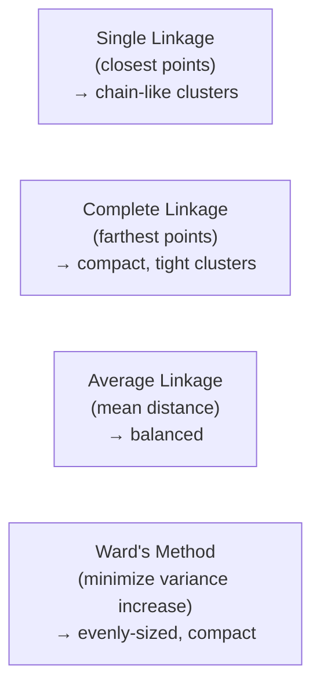

---

# PART 5 — Combining PCA with Clustering

## 15. How Can You Visualize Clusters in Reduced Dimensions?

Real datasets often have far more than 2-3 features, so you can't directly plot clusters. The standard approach: run **PCA** to reduce the data down to 2 (or 3) principal components, then plot the data on those axes, coloring each point by its assigned cluster label.

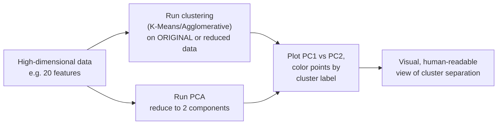

This lets you visually sanity-check whether clusters look well-separated and sensible, even though the actual clustering happened in the full original feature space (or a reduced space — see below).

---

## 16. How Can Dimensionality Reduction Affect Clustering Results?

Running PCA **before** clustering (rather than just for visualization afterward) can genuinely change the clustering outcome — for better or worse:

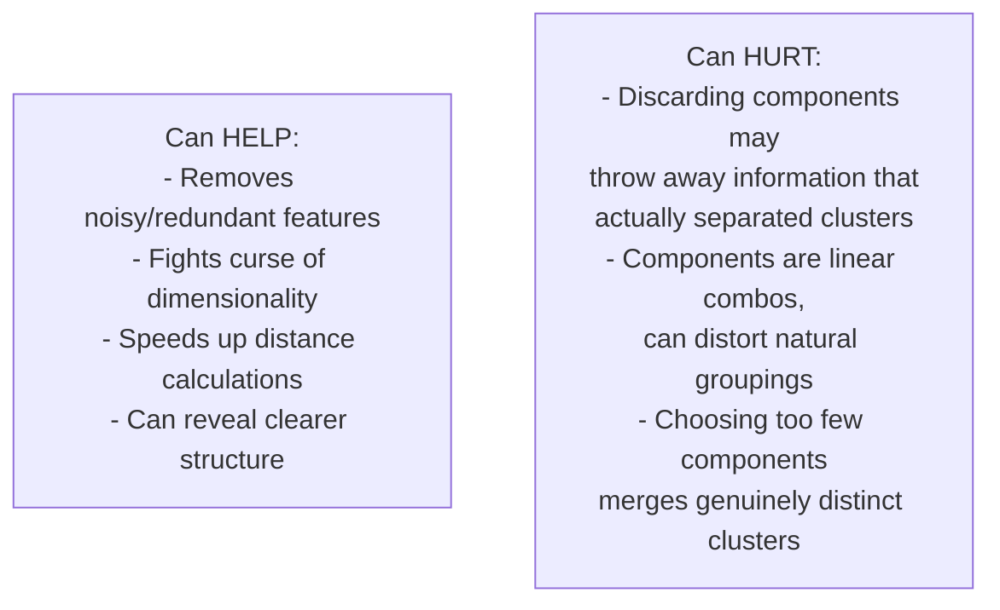

**Practical guidance:**
- If you have many noisy or highly correlated features, PCA before clustering often improves results by removing distracting variance.
- If you have relatively few, already-meaningful features, clustering directly (without PCA) may preserve more of the true structure.
- Always check explained variance retained — reducing to components that explain, say, only 50% of variance risks discarding information that clusters actually depend on.
- It's common practice to **standardize → PCA → cluster → visualize on the first 2 PCA components**, as a full end-to-end pipeline.

---

## Quick Reference — One-Sentence Summary Per Objective

- **Unsupervised learning**: finding structure in unlabeled data (no target/answer given).
- **Unsupervised vs supervised**: supervised learns a mapping to known labels; unsupervised discovers hidden patterns with no labels.
- **Standardization before clustering**: puts features on equal footing so no single feature dominates distance calculations.
- **Dimensionality reduction**: compresses many features into fewer while preserving important information; fights the curse of dimensionality and speeds up computation.
- **PCA**: finds new axes (principal components) ordered by how much variance they capture, letting you keep only the most informative ones.
- **Explained variance**: the percentage of total data variance captured by each component — guides how many components to keep.
- **K-Means clustering**: iteratively assigns points to the nearest of K centroids, then recomputes centroids, until convergence.
- **Cluster centroids**: the mean position of all points currently assigned to a cluster.
- **Elbow Method**: plots inertia vs K to find the point of diminishing returns, suggesting a good K.
- **Evaluating cluster quality**: internal metrics like inertia, Silhouette Score, and Davies-Bouldin Index, since there's no ground truth.
- **Silhouette Score**: measures how well each point fits its own cluster vs the nearest other cluster, from -1 to +1.
- **Agglomerative clustering**: bottom-up merging of the closest clusters, one pair at a time, until one cluster remains.
- **Dendrogram**: a tree diagram of the merge history; cutting it at different heights yields different numbers of clusters.
- **Linkage methods**: define how distance between clusters is measured (single, complete, average, Ward) and shape the resulting cluster structure.
- **Visualizing clusters in reduced dimensions**: run PCA to 2D/3D, then plot points colored by cluster label.
- **Dimensionality reduction's effect on clustering**: can help by removing noise, but can also hurt by discarding information that separated the true clusters — always check explained variance retained.
